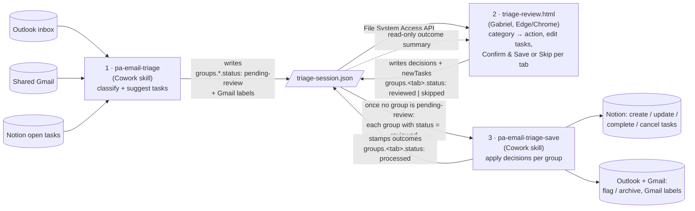

# PA Email Triage — review page

`triage-review.html` is a single static page: **step 2 of a three-step email-triage loop**. Claude proposes what to do with each email (step 1), Gabriel reviews and confirms on this page (step 2), Claude applies the confirmed decisions to Notion and the mailboxes (step 3). No build, no server, no dependencies — push to `master` and GitHub Pages serves it.

**Live:** https://gabriel-serra-aus.github.io/claude-code-pa-email-triage/triage-review.html

| URL | Shows |
|---|---|
| `triage-review.html` | both tabs — Personal and Gabriel & Arina |
| `triage-review.html?type=gabriel` | Personal only |
| `triage-review.html?type=gna` | Gabriel & Arina only |

Open in **Edge** or **Chrome** — it needs the File System Access API (`showOpenFilePicker`); other browsers get a "not supported" screen.

---

## 1. The loop and the two skills

Everything is exchanged through **one file** — there are no APIs between the steps:

`D:\Gabriel\OneDrive\Claude\Workspace\Personal Assistance\email-triage\triage-session.json`

| Step | Who | Reads | Writes | `groups.<tab>.status` after |
|---|---|---|---|---|
| 1. Triage | **pa-email-triage** (Cowork skill) | Outlook inbox, shared Gmail inbox, open Notion tasks | the session file: emails + category + `suggestedTask` + matched Notion tasks (`existingTaskUrl`, `existingTasks`) | `pending-review` |
| 2. Review | **this page** (Gabriel) | the session file | the same file: `decision` blocks, `newTasks`, `groups.<tab>` | `reviewed` (Confirm & Save) or `skipped` (Skip) for **that tab only** — the other tab stays `pending-review` until it gets its own Confirm or Skip |
| 3. Save | **pa-email-triage-save** (Cowork skill) | **only once neither group is `pending-review`**; then every group whose status is `reviewed` | Notion (create/update/complete/cancel), Outlook/Gmail (flag or archive); stamps per-item outcomes + `groups.<tab>.processedAt` | `processed` or `processed-with-errors` for that group; `skipped` groups stay `skipped` |

**Input** of the page = the file as written by pa-email-triage. **Output** = the same file with `decision` blocks, `newTasks` and `groups.<personal|shared>.status: "reviewed"` or `"skipped"` — which is the entire input of pa-email-triage-save. **Each group has its own status and is decided independently**: Personal can be confirmed while Gabriel & Arina is skipped, and vice-versa — but the save skill only runs once **both** have been decided (no group left `pending-review`). **There is no session-level status** — `groups.personal.status` and `groups.shared.status` are the only two, and `groups` never has a third key (the page strips legacy `status` / `reviewedGroups` / `skippedGroups` / `processedAt` keys on load). The page makes **no network calls**; the whole JSON is loaded, mutated in place and written back, so every field it does not know about is preserved.

Two mailboxes → two review queues (tabs):

| Mailbox | `email.source` | Tab | Task group rule |
|---|---|---|---|
| Gabriel's Outlook | `outlook` | **Personal** | task may be in any group **except** "Gabriel & Arina" |
| Shared Gmail (Gabriel & Arina) | `gmail` | **Gabriel & Arina** | task **locked** to group "Gabriel & Arina" |

Existing Notion tasks and manually added tasks land on a tab by their `group` (shared group → Gabriel & Arina, anything else → Personal).

---

## 2. Screens

- **Landing** — "Open triage-session.json" (file picker). The handle is kept in IndexedDB (`triage-review` DB), so later visits reload silently if permission persists, or show a one-click **Reopen**.
- **Review** (`pending-review`) — per tab:
  1. **Emails** — from, subject, date/age, Claude's summary, 🚩 if `isFlagged`, source badge, deep link (`suggestedTask.link`, else built from `id`: `outlook.live.com/mail/0/inbox/id/…` or `mail.google.com/mail/u/0/#inbox/…`). Filter by category. Each row has a **Category** ribbon and an **Action** ribbon (§3). Emails already matched to a Notion task show **✓ Tracked** instead of a category.
  2. **Existing Notion tasks** for this tab — Open / Done / Cancelled select + **Edit** (task editor with live diff against Notion).
  3. **New tasks** — **+ Add task**; editable/deletable until confirmed.
  4. **Sticky bar** — counts for the tab (tasks to create / to flag / to archive / task updates, done, cancelled, edited, new), **Skip — <tab>** and **Confirm & Save — <tab>**.
- **Reviewed** (`reviewed`) — read-only "waiting for pa-email-triage-save".
- **Skipped** (`skipped`) — read-only "pa-email-triage-save will leave it alone", with a **Reopen for review** button that puts the tab back to `pending-review` (only possible while the save skill hasn't run).
- **Processed** (`processed` / `processed-with-errors`) — read-only outcome list: one row per email, existing task and new task with the outcome the save skill stamped (first of `outcome | result | applied | processed` on the item; text containing "fail" is red). Without an outcome field the badge falls back to the decision ("Archive", "completed", "created"…).

Light/dark toggle, remembered in `localStorage` (`triage-theme`).

---

## 3. Decision model

**The category is the only thing Gabriel decides; it drives the action, and the action is exactly what the save skill will do.** Both are one-click icon ribbons, never dropdowns; there is no "undecided" state, so Confirm is always available. Changing the category resets the action to that category's default.

### Emails without a Notion task

| Category | Actions (first = default) |
|---|---|
| Not Important | `archive` (locked) |
| FYI | `archive` · `flag` |
| Important | `create-task` · `flag` · `archive` |

Every email ends up either **kept in the inbox** or **archived** — there is no leave-alone and no create-email. `flag` (shown as "Keep in inbox"), `create-task` and `update-task` keep it in the inbox; `archive`, `complete-task` and `cancel-task` archive it.

The **star (Gmail) / flag (Outlook) is its own property** — a toggle on each row that writes `decision.flagged` (default = the mailbox's current `isFlagged`; choosing a keep-in-inbox action switches it on as a convenience). It is independent of the action: an archived email can stay starred. Gmail rows also show the message's **system labels** (Important, Updates, Promotions…) as muted read-only chips next to the editable user labels.

- `create-task` — the task created is `decision.task` (Gabriel's edit) → else `suggestedTask` (Claude's) → else a **fallback** from subject + summary, built on Confirm. **Edit task** opens the editor (title, description, group, tags, due date); **Reset** returns to the suggestion. The email deep link is carried on the task automatically.
- `flag` / `archive` — nothing under the ribbon.

### Emails tracked in Notion (`existingTaskUrl` set)

No category. Actions: `update-task` (default) · `complete-task` · `cancel-task`.

- All three refresh the task's **auto comment** (below). `complete-task` / `cancel-task` also archive the email.
- Complete/cancel is **mirrored** both ways with the matched task (`existingTasks[].decision.complete / .cancel`): Done/Cancelled on the task sets the action on every email matched to it, and vice versa.
- **Open & edit task** jumps to the editor for the matched task.

### Task description = Gabriel's part + Claude's briefing

Split at the literal marker line `-- auto comment --`:

- **Above** — Gabriel's own text, never touched.
- **Below** — Claude's briefing: one `DD Mon: summary` line per email matched to the task, **replaced on every run**.

On Confirm, any tracked task whose briefing would change gets `decision.edits.notes` = full new description (Gabriel's part + fresh briefing). If Gabriel edited the description by hand in this session, that edit wins and the briefing is not regenerated.

### Existing-task edits

The editor records only **changed** fields versus Notion: `decision.edits = { title?, notes?, group?, tags?, dueDate? }`, or `null` if nothing changed. It shows a live diff (unchanged muted, added green, removed red).

### Hard rules

- Gmail-sourced tasks → group locked to "Gabriel & Arina"; Outlook-sourced tasks → never that group. Enforced in the editor and re-applied on Confirm. Manual new tasks are unrestricted (their group decides the tab).
- Fixed lists: groups `Work | Personal | Gabriel & Arina | New Ideas`; tags `Admin | Finance | Health | Property | Dev | Research | Errand`.
- `decision.isTask` is derived: `true` only when `emailAction === "create-task"`.

---

## 4. Confirm & Save / Skip — per tab

**The file is written only here.** Editing decisions on the page changes nothing on disk until you press one of the two buttons in the sticky bar. Both go through `writeGroupStatus()`:

1. `materializeDecisions()` — syncs derived fields, builds fallback tasks for Important emails without one, enforces the group rule, turns pending auto comments into `edits.notes`.
2. **Stale-tab guard** — re-reads the file and refuses to write if *this group* is no longer `pending-review` on disk (a forgotten old tab cannot clobber a reviewed/skipped/processed group). The other group's `groups.<tab>` entry is taken from disk, and if it has moved on (decided elsewhere or already processed) its emails / tasks / newTasks are adopted from disk too, so nothing that was already decided is overwritten.
3. Sets `groups.<personal|shared> = { status: "reviewed" | "skipped", reviewedAt: <ISO>, processedAt: null }` for **this tab only** (`reviewedAt` = when Gabriel decided, for both buttons); the tab becomes read-only. The other tab stays `pending-review` and fully editable. A **skipped** tab keeps its drafted decisions in the file (the save skill ignores them) and offers **Reopen for review**, which writes it back to `pending-review` (guard: still `skipped` on disk) with `reviewedAt: null`.
4. Writes the whole JSON (pretty-printed). On failure the group status is rolled back so the UI stays editable.

`pa-email-triage-save` refuses to run while either group is still `pending-review`, so every session ends with each tab either confirmed or skipped.

A tab whose group is `processed` / `processed-with-errors` shows that group's read-only outcome summary instead of the review UI.

The page never writes `processedAt` or per-item outcome fields — those belong to the save skill.

---

## 5. File contract — `triage-session.json`

**The JSON is defined in exactly one place: [`triage-session.schema.jsonc`](triage-session.schema.jsonc)** (this repo). It is an annotated example of the whole file — every key, which step writes it, the action vocabulary, the group lifecycle, the Gmail-labels rule and the per-step checklists. There is deliberately no copy of it here or in `EMAIL-TRIAGE.md`; when the page changes what it reads or writes, change the schema file, then the code. All three steps (pa-email-triage, this page, pa-email-triage-save) follow it.

Top-level keys, for orientation only: `generatedAt`, `mailboxes`, `gmailLabels`, `groups.{personal,shared}` (the only two statuses in the file), `emails[]`, `existingTasks[]`, `newTasks[]`.

**Loading rules** (`applyLoadDefaults`): a file without an `emails` array is rejected. Missing `decision` / `existingTasks` / `newTasks` are created; an invalid category becomes `FYI`; an action that is missing or not allowed for that email (legacy `none` / `create-email` / `isTask` yes-no files) is derived — from the matched task's Done/Cancelled if tracked, from `isTask: true` → `create-task`, legacy `none` / `create-email` → `flag`, else the category default.

### What pa-email-triage must produce

`generatedAt`, `groups.personal` / `groups.shared` both `pending-review`, `gmailLabels`, `emails[]` with `id`, `source`, `category`, `summary` (Gmail: `labels`), and for each email either `existingTaskUrl` (pointing at an entry in `existingTasks[]`) or an optional `suggestedTask` (Gmail: `tags` = `labels`). `decision` blocks may be omitted — the page fills them.

### Gmail labels ≡ Notion Tags

Gmail user labels and the Notion **Tags** property share one namespace (identical names). On the page a Gmail email shows its labels as clickable chips; for an email linked to a task (create-task or tracked) the labels and the task's tags are **one value** — editing either side updates the other (`syncTaskFromLabels` / `syncLabelsFromTags`). The task editor offers `gmailLabels ∪ base tags`. The save skill applies the label diff (`labels` → `decision.labels`) to Gmail and the tags to Notion, creating missing labels / tag options as needed. Outlook emails have no labels.

### What pa-email-triage-save must honour

- **Gate first:** if `groups.personal.status` or `groups.shared.status` is `pending-review`, stop and touch nothing — Gabriel must Confirm or Skip every tab before anything is applied.
- Then act **per group**: for each `groups.<tab>` whose `status === "reviewed"`, apply that group's items only — `personal` = emails with `source !== "gmail"` + tasks whose `group !== "Gabriel & Arina"`; `shared` = Gmail emails + tasks in "Gabriel & Arina". Never touch a group that is `skipped` (its `decision` blocks are drafts Gabriel chose not to apply — leave the status `skipped`) or already `processed`.
- After processing, set `groups.<tab>.status` to `"processed"` / `"processed-with-errors"` and `groups.<tab>.processedAt`. Never write a session-level `status`.
- Gmail emails of a reviewed `shared` group (every action, archive included): add `decision.labels − labels`, remove `labels − decision.labels` (create a Gmail label if missing). Task tags: create any missing option on the Notion Tags property before writing.
- Legacy files (no `groups`, only `status` / `reviewedGroups`; or `groups` plus an orphan `reviewedGroups` stamp from the old page) are migrated by the page on load (`ensureGroups`); the save skill only needs to understand `groups`.
- Email actions decide inbox vs archive only: `archive` → archive; `flag` → keep in inbox; `create-task` → create the Notion task from `decision.task ?? suggestedTask` (the page guarantees one of them), keep in inbox; `update-task` → apply the matched task's `decision.edits`, keep in inbox; `complete-task` / `cancel-task` → set the task status (Done / Cancelled) **and** archive the email. Never delete, never reply.
- Star/flag, every email of a reviewed group: `decision.flagged !== isFlagged` → Gmail add/remove `STARRED` / Outlook `flag_email` flagged / notFlagged; equal → nothing. Never touch `systemLabels`.
- Existing tasks: apply `edits` (only changed fields present), then `complete` / `cancel`.
- `newTasks`: create each in Notion.
- Stamp a string outcome on each processed item (`outcome`), plus the group-level status/`processedAt` described above.

---

## 6. Repo contents

| File | Purpose |
|---|---|
| `triage-session.schema.jsonc` | Annotated example of the session file — the single contract every skill and the page must follow |
| `triage-review.html` | the whole app — vanilla JS + CSS in one file |
| `CLAUDE.md` | guidance for Claude Code (decision model, file contract, editing tips) |
| `improvements.md` | log of the Aug 2026 UI rework — add to it for deliberate UX changes |
| `.mcp.json` | Outlook MCP server used by Claude Code in this repo |

Quick syntax check after edits: extract the `<script>` body and run `node --check` on it. The earlier Next.js app (Apr–Aug 2026) and the `localhost:8765` server scripts were removed on 29 Aug 2026 and remain in git history only.
