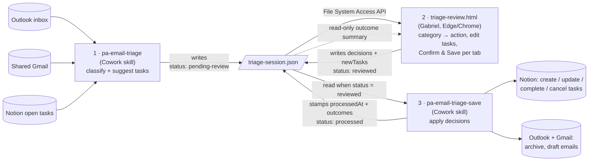

# PA Email Triage — review page

`triage-review.html` is a single static page: **step 2 of a three-step email-triage loop**. Claude proposes what to do with each email (step 1), Gabriel reviews and confirms on this page (step 2), Claude applies the confirmed decisions to Notion and the mailboxes (step 3). No build, no server, no dependencies — push to `master` and GitHub Pages serves it.

**Live:** https://gabriel-serra-aus.github.io/claude-code-pa-email-triage/triage-review.html

| URL | Shows |
|---|---|
| `triage-review.html` | both tabs — Personal and Gabriel & Arina |
| `triage-review.html?type=gabriel` | Personal only |
| `triage-review.html?type=gna` | Gabriel & Arina only |

Open in **Edge** or **Chrome** — it needs the File System Access API (`showOpenFilePicker`); other browsers get a "not supported" screen.

---

## 1. The loop and the two skills

Everything is exchanged through **one file** — there are no APIs between the steps:

`D:\Gabriel\OneDrive\Claude\Workspace\Personal Assistance\email-triage\triage-session.json`



| Step | Who | Reads | Writes | `status` after |
|---|---|---|---|---|
| 1. Triage | **pa-email-triage** (Cowork skill) | Outlook inbox, shared Gmail inbox, open Notion tasks | the session file: emails + category + `suggestedTask` + matched Notion tasks (`existingTaskUrl`, `existingTasks`) | `pending-review` |
| 2. Review | **this page** (Gabriel) | the session file | the same file: `decision` blocks, `newTasks`, `reviewedGroups`, `skippedGroups` | `reviewed` once every visible tab is confirmed |
| 3. Save | **pa-email-triage-save** (Cowork skill) | the reviewed file | Notion (create/update/complete/cancel), Outlook/Gmail (archive, draft emails); stamps `processedAt` + per-item outcomes | `processed` or `processed-with-errors` |

**Input** of the page = the file as written by pa-email-triage. **Output** = the same file with `decision` blocks, `newTasks`, `reviewedGroups`/`skippedGroups` and `status: "reviewed"` — which is the entire input of pa-email-triage-save. The page makes **no network calls**; the whole JSON is loaded, mutated in place and written back, so every field it does not know about is preserved.

Two mailboxes → two review queues (tabs):

| Mailbox | `email.source` | Tab | Task group rule |
|---|---|---|---|
| Gabriel's Outlook | `outlook` | **Personal** | task may be in any group **except** "Gabriel & Arina" |
| Shared Gmail (Gabriel & Arina) | `gmail` | **Gabriel & Arina** | task **locked** to group "Gabriel & Arina" |

Existing Notion tasks and manually added tasks land on a tab by their `group` (shared group → Gabriel & Arina, anything else → Personal).

---

## 2. Screens

- **Landing** — "Open triage-session.json" (file picker). The handle is kept in IndexedDB (`triage-review` DB), so later visits reload silently if permission persists, or show a one-click **Reopen**.
- **Review** (`pending-review`) — per tab:
  1. **Emails** — from, subject, date/age, Claude's summary, 🚩 if `isFlagged`, source badge, deep link (`suggestedTask.link`, else built from `id`: `outlook.live.com/mail/0/inbox/id/…` or `mail.google.com/mail/u/0/#inbox/…`). Filter by category. Each row has a **Category** ribbon and an **Action** ribbon (§3). Emails already matched to a Notion task show **✓ Tracked** instead of a category.
  2. **Existing Notion tasks** for this tab — Open / Done / Cancelled select + **Edit** (task editor with live diff against Notion).
  3. **New tasks** — **+ Add task**; editable/deletable until confirmed.
  4. **Sticky bar** — counts for the tab (archive / task / email / none, edited, new) and **Confirm & Save — <tab>**.
- **Reviewed** (`reviewed`) — read-only "waiting for pa-email-triage-save".
- **Processed** (`processed` / `processed-with-errors`) — read-only outcome list: one row per email, existing task and new task with the outcome the save skill stamped (first of `outcome | result | applied | processed` on the item; text containing "fail" is red). Without an outcome field the badge falls back to the decision ("Archive", "completed", "created"…).

Light/dark toggle, remembered in `localStorage` (`triage-theme`).

---

## 3. Decision model

**The category is the only thing Gabriel decides; it drives the action, and the action is exactly what the save skill will do.** Both are one-click icon ribbons, never dropdowns; there is no "undecided" state, so Confirm is always available. Changing the category resets the action to that category's default.

### Emails without a Notion task

| Category | Actions (first = default) |
|---|---|
| Not Important | `archive` (locked) |
| FYI | `archive` · `none` |
| Important | `create-task` · `create-email` · `none` |

- `create-task` — the task created is `decision.task` (Gabriel's edit) → else `suggestedTask` (Claude's) → else a **fallback** from subject + summary, built on Confirm. **Edit task** opens the editor (title, description, group, tags, due date); **Reset** returns to the suggestion. The email deep link is carried on the task automatically.
- `create-email` — the save skill drafts a reply; nothing to edit on the page.
- `archive` / `none` — nothing under the ribbon.

### Emails tracked in Notion (`existingTaskUrl` set)

No category. Actions: `update-task` (default) · `complete-task` · `cancel-task`.

- All three refresh the task's **auto comment** (below). `complete-task` / `cancel-task` also archive the email.
- Complete/cancel is **mirrored** both ways with the matched task (`existingTasks[].decision.complete / .cancel`): Done/Cancelled on the task sets the action on every email matched to it, and vice versa.
- **Open & edit task** jumps to the editor for the matched task.

### Task description = Gabriel's part + Claude's briefing

Split at the literal marker line `-- auto comment --`:

- **Above** — Gabriel's own text, never touched.
- **Below** — Claude's briefing: one `DD Mon: summary` line per email matched to the task, **replaced on every run**.

On Confirm, any tracked task whose briefing would change gets `decision.edits.notes` = full new description (Gabriel's part + fresh briefing). If Gabriel edited the description by hand in this session, that edit wins and the briefing is not regenerated.

### Existing-task edits

The editor records only **changed** fields versus Notion: `decision.edits = { title?, notes?, group?, tags?, dueDate? }`, or `null` if nothing changed. It shows a live diff (unchanged muted, added green, removed red).

### Hard rules

- Gmail-sourced tasks → group locked to "Gabriel & Arina"; Outlook-sourced tasks → never that group. Enforced in the editor and re-applied on Confirm. Manual new tasks are unrestricted (their group decides the tab).
- Fixed lists: groups `Work | Personal | Gabriel & Arina | New Ideas`; tags `Admin | Finance | Health | Property | Dev | Research | Errand`.
- `decision.isTask` is derived: `true` only when `emailAction === "create-task"`.

---

## 4. Confirm & Save — per tab

Pressing **Confirm & Save — <tab>**:

1. `materializeDecisions()` — syncs derived fields, builds fallback tasks for Important emails without one, enforces the group rule, turns pending auto comments into `edits.notes`.
2. **Stale-tab guard** — re-reads the file and refuses to write if it is no longer `pending-review` (a forgotten old tab cannot clobber a reviewed/processed session). `reviewedGroups` from disk is merged in, so the other tab's confirmation is never lost.
3. Stamps `reviewedGroups.<personal|shared>` with an ISO timestamp; the tab becomes read-only.
4. When **every visible tab** is confirmed → `status: "reviewed"`. Any tab hidden by `?type=…` that has not itself been confirmed is **neutralised** first — its emails get `emailAction: "none"`, `isTask: false`, `task: null`; its existing tasks get `complete: false, cancel: false, edits: null`; its new tasks are removed — and it is listed in `skippedGroups`. The save skill therefore keys off `status` alone and can never act on a group that was not reviewed.
5. Writes the whole JSON (pretty-printed). On failure the status and timestamp are rolled back so the UI stays editable.

The page never writes `processedAt` or per-item outcome fields — those belong to the save skill.

---

## 5. File contract — `triage-session.json`

```jsonc
{
  "status": "pending-review",            // → "reviewed" → "processed" | "processed-with-errors"
  "generatedAt": "2026-08-29T08:00:00Z",  // step 1
  "reviewedGroups": { "personal": "…ISO…", "shared": "…ISO…" },   // step 2, per tab
  "skippedGroups": ["shared"],            // step 2, only when a tab was hidden by ?type=
  "processedAt": "…ISO…",                 // step 3 only — page never writes it

  "emails": [{
    "id": "…",                            // mailbox message id (used for the deep link)
    "source": "outlook" | "gmail",
    "from": "Name <addr>", "subject": "…", "date": "…ISO…",
    "summary": "…",                       // Claude's summary; also feeds the auto comment
    "isFlagged": false,
    "category": "Important" | "FYI" | "Not Important",
    "existingTaskUrl": "https://notion.so/…" | null,   // set ⇒ "tracked"; must match an existingTasks[].url
    "suggestedTask": { "title", "notes", "group", "tags": [], "dueDate": "YYYY-MM-DD" | "", "link" } | null,
    "decision": {
      "emailAction": "archive" | "none" | "create-task" | "create-email"
                   | "update-task" | "complete-task" | "cancel-task",
      "isTask": false,                    // derived: emailAction === "create-task"
      "task": { …same shape as suggestedTask… } | null   // Gabriel's edited copy / fallback
    },
    "outcome": "…"                        // step 3 (or result / applied / processed)
  }],

  "existingTasks": [{
    "url": "https://notion.so/…", "title": "…", "notes": "…", "status": "…",
    "group": "…", "tags": [], "dueDate": "YYYY-MM-DD" | "",
    "decision": {
      "complete": false, "cancel": false,
      "edits": { "title"?, "notes"?, "group"?, "tags"?, "dueDate"? } | null
    },
    "outcome": "…"                        // step 3
  }],

  "newTasks": [{ "title", "notes", "group", "tags": [], "dueDate" }]   // added by Gabriel on the page
}
```

**Loading rules** (`applyLoadDefaults`): a file without an `emails` array is rejected. Missing `decision` / `existingTasks` / `newTasks` are created; an invalid category becomes `FYI`; an action that is missing or not allowed for that email (legacy `flag` / `isTask` yes-no files) is derived — from the matched task's Done/Cancelled if tracked, from `isTask: true` → `create-task`, else the category default.

### What pa-email-triage must produce

`status: "pending-review"`, `generatedAt`, `emails[]` with `id`, `source`, `category`, `summary`, and for each email either `existingTaskUrl` (pointing at an entry in `existingTasks[]`) or an optional `suggestedTask`. `decision` blocks may be omitted — the page fills them.

### What pa-email-triage-save must honour

- Act only when `status === "reviewed"`; groups in `skippedGroups` are already neutralised.
- Email actions: `archive` → archive; `none` → nothing; `create-task` → create the Notion task from `decision.task` (guaranteed present); `create-email` → draft the email; `update-task` → apply the matched task's `decision.edits`; `complete-task` / `cancel-task` → set the task status **and** archive the email.
- Existing tasks: apply `edits` (only changed fields present), then `complete` / `cancel`.
- `newTasks`: create each in Notion.
- Stamp `processedAt`, a string outcome on each item, and `status: "processed"` (or `"processed-with-errors"`).

---

## 6. Repo contents

| File | Purpose |
|---|---|
| `triage-review.html` | the whole app — vanilla JS + CSS in one file |
| `CLAUDE.md` | guidance for Claude Code (decision model, file contract, editing tips) |
| `improvements.md` | log of the Aug 2026 UI rework — add to it for deliberate UX changes |
| `.mcp.json` | Outlook MCP server used by Claude Code in this repo |

Quick syntax check after edits: extract the `<script>` body and run `node --check` on it. The earlier Next.js app (Apr–Aug 2026) and the `localhost:8765` server scripts were removed on 29 Aug 2026 and remain in git history only.
