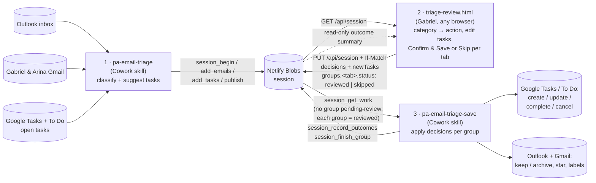

# PA Email Triage — review page

`public/triage-review.html` is a single static page: **step 2 of a three-step email-triage loop**. Claude proposes what to do with each email (step 1), Gabriel reviews and confirms on this page (step 2), Claude applies the confirmed decisions to the task apps and the mailboxes (step 3). The page, the session store and the skills' connector are **one Netlify site** — push the branch Netlify builds from and it deploys.

**Live:** https://pa-email-triage.netlify.app (`/` redirects to `/triage-review.html`)

| URL | Shows |
|---|---|
| `triage-review.html` | both tabs — Gabriel and Gabriel & Arina |
| `triage-review.html?type=gabriel` | Gabriel only |
| `triage-review.html?type=gna` | Gabriel & Arina only |

Works in any browser, phones and iPads included. **Sign in with Google** — only the one address in `ALLOWED_EMAILS` gets in; the sign-in lasts 30 days per browser.

---

## 1. The loop and the two skills

Everything is exchanged through **one session** in Netlify Blobs (store `triage`, key `session`). The page reaches it through `/api/session`; the two skills through the `triage-session` MCP connector (`/mcp/<secret>`). Nothing else touches the store.

| Step | Who | Reads | Writes | `groups.<tab>.status` after |
|---|---|---|---|---|
| 1. Triage | **pa-email-triage** (Cowork skill) | Outlook inbox, Gabriel & Arina Gmail inbox, open Google Tasks / To Do tasks | a **draft** (`session_begin`, `session_add_emails`, `session_add_tasks`), then `session_publish` makes it the live session | `pending-review` |
| 2. Review | **this page** (Gabriel) | `GET /api/session` | `PUT /api/session`: `decision` blocks, `newTasks`, `groups.<tab>` | `reviewed` (Confirm & Save) or `skipped` (Skip) for **that tab only** — the other tab stays `pending-review` until it gets its own Confirm or Skip |
| 3. Save | **pa-email-triage-save** (Cowork skill) | `session_status` gate: **only once neither group is `pending-review`**; then `session_get_work` for every group whose status is `reviewed` | task apps (create/update/complete/cancel), Outlook/Gmail (keep or archive, star, labels); `session_record_outcomes` + `session_finish_group` | `processed` or `processed-with-errors` for that group; `skipped` groups stay `skipped` |

**Input** of the page = the session as published by pa-email-triage. **Output** = the same session with `decision` blocks, `newTasks` and `groups.<gabriel|gabriel-arina>.status: "reviewed"` or `"skipped"` — which is the entire input of pa-email-triage-save. **Each group has its own status and is decided independently**: Gabriel can be confirmed while Gabriel & Arina is skipped, and vice-versa — but the save skill only runs once **both** have been decided (no group left `pending-review`). **There is no session-level status** — `groups.gabriel.status` and `groups["gabriel-arina"].status` are the only two, and `groups` never has a third key. The page talks to nothing but `/api/session`; the whole JSON is loaded, mutated in place and written back, so every field it does not know about is preserved — and the server enforces who may change what (§4).

Two mailboxes → two review queues (tabs):

| Mailbox | `email.source` | Tab | Task group rule |
|---|---|---|---|
| Gabriel's Outlook | `outlook` | **Gabriel** | task may be in any group **except** "Gabriel & Arina" |
| Gabriel & Arina Gmail | `gmail` | **Gabriel & Arina** | task **locked** to group "Gabriel & Arina" |

Existing Notion tasks and manually added tasks land on a tab by their `group` ("Gabriel & Arina" → that tab, anything else → Gabriel).

---

## 2. Screens

- **Landing** — **Sign in with Google** (full-page redirect, `?type=` survives it). A signed-in browser goes straight to the session; no session yet → "No session yet — run pa-email-triage."; a Google account that is not allowed → "This Google account is not allowed." The header has **Reload** (re-fetch; in-memory edits on pending tabs are lost) and **Sign out** (this browser only).
- **Review** (`pending-review`) — per tab:
  1. **Emails** — from, subject, date/age, Claude's summary, 🚩 if `isFlagged`, source badge, deep link (`suggestedTask.link`, else built from `id`: `outlook.live.com/mail/0/inbox/id/…` or `mail.google.com/mail/u/0/#inbox/…`). Filter by category. Each row has a **Category** ribbon and an **Action** ribbon (§3). Emails already matched to a Notion task show **✓ Tracked** instead of a category.
  2. **Existing Notion tasks** for this tab — Open / Done / Cancelled select + **Edit** (task editor with live diff against Notion).
  3. **New tasks** — **+ Add task**; editable/deletable until confirmed.
  4. **Sticky bar** — counts for the tab (tasks to create / to flag / to archive / task updates, done, cancelled, edited, new), **Skip — <tab>** and **Confirm & Save — <tab>**.
- **Reviewed** (`reviewed`) — read-only "waiting for pa-email-triage-save".
- **Skipped** (`skipped`) — read-only "pa-email-triage-save will leave it alone", with a **Reopen for review** button that puts the tab back to `pending-review` (only possible while the save skill hasn't run).
- **Processed** (`processed` / `processed-with-errors`) — read-only outcome list: one row per email, existing task and new task with the outcome the save skill stamped (first of `outcome | result | applied | processed` on the item; text containing "fail" is red). Without an outcome field the badge falls back to the decision ("Archive", "completed", "created"…).

Light/dark toggle, remembered in `localStorage` (`triage-theme`).

---

## 3. Decision model

**The category is the only thing Gabriel decides; it drives the action, and the action is exactly what the save skill will do.** Both are one-click icon ribbons, never dropdowns; there is no "undecided" state, so Confirm is always available. Changing the category resets the action to that category's default.

### Emails without a Notion task

| Category | Actions (first = default) |
|---|---|
| Not Important | `archive` (locked) |
| FYI | `flag` (keep in inbox) · `archive` |
| Important | `create-task` · `flag` (keep in inbox, no task) |

Every email ends up either **kept in the inbox** or **archived** — there is no leave-alone and no create-email. `flag` (shown as "Keep in inbox"), `create-task` and `update-task` keep it in the inbox; `archive`, `complete-task` and `cancel-task` archive it.

The **star (Gmail) / flag (Outlook) is its own property** — a toggle beside the action ribbon that writes `decision.flagged` (default = the mailbox's current `isFlagged`; no action ever changes it, so "Keep in inbox" leaves an unflagged email unflagged). It is independent of the action: an archived email can stay starred. Gmail rows also show the message's **system labels** (Important, Updates, Promotions…) as muted read-only chips next to the editable user labels.

- `create-task` — the task created is `decision.task` (Gabriel's edit) → else `suggestedTask` (Claude's) → else a **fallback** from subject + summary, built on Confirm. **Edit task** opens the editor (title, description, group, tags, due date); **Reset** returns to the suggestion. The email deep link is carried on the task automatically.
- `flag` / `archive` — nothing under the ribbon.

### Emails tracked in Notion (`existingTaskUrl` set)

No category. Actions: `update-task` (default) · `complete-task` · `cancel-task`.

- All three refresh the task's **auto comment** (below). `complete-task` / `cancel-task` also archive the email.
- Complete/cancel is **mirrored** both ways with the matched task (`existingTasks[].decision.complete / .cancel`): Done/Cancelled on the task sets the action on every email matched to it, and vice versa.
- **Open & edit task** jumps to the editor for the matched task.

### Task description = Gabriel's part + Claude's briefing

Split at the literal marker line `-- auto comment --`:

- **Above** — Gabriel's own text, never touched.
- **Below** — Claude's briefing: one `DD Mon: summary` line per email matched to the task, **replaced on every run**.

On Confirm, any tracked task whose briefing would change gets `decision.edits.notes` = full new description (Gabriel's part + fresh briefing). If Gabriel edited the description by hand in this session, that edit wins and the briefing is not regenerated.

### Existing-task edits

The editor records only **changed** fields versus Notion: `decision.edits = { title?, notes?, group?, tags?, dueDate? }`, or `null` if nothing changed. It shows a live diff (unchanged muted, added green, removed red).

### Hard rules

- Gmail-sourced tasks → group locked to "Gabriel & Arina"; Outlook-sourced tasks → never that group. Enforced in the editor and re-applied on Confirm. Manual new tasks are unrestricted (their group decides the tab).
- Fixed lists: groups `Work | Gabriel | Gabriel & Arina | New Ideas`; tags `Admin | Finance | Health | Property | Dev | Research | Errand`.
- `decision.isTask` is derived: `true` only when `emailAction === "create-task"`.

---

## 4. Confirm & Save / Skip — per tab

**The session is written only here.** Editing decisions on the page changes nothing in the store until you press one of the two buttons in the sticky bar. Both go through `writeGroupStatus()`:

1. `materializeDecisions()` — syncs derived fields, builds fallback tasks for Important emails without one, makes every child decision explicit.
2. **Stale-tab guard** — re-reads the session (`GET`, keeping its `ETag`) and refuses to write if *this group* is no longer `pending-review` (a forgotten old tab cannot clobber a reviewed/skipped/processed group): toast `Not saved — <tab> is already "<status>". Reload to see it.` The other group's `groups.<tab>` entry is taken from the stored copy, and if it has moved on (decided elsewhere or already processed) its emails / tasks / newTasks are adopted too, so nothing that was already decided is overwritten.
3. Sets `groups.<gabriel|gabriel-arina> = { status: "reviewed" | "skipped", reviewedAt: <ISO>, processedAt: null }` for **this tab only** (`reviewedAt` = when Gabriel decided, for both buttons); the tab becomes read-only. The other tab stays `pending-review` and fully editable. A **skipped** tab keeps its drafted decisions in the session (the save skill ignores them) and offers **Reopen for review**, which writes it back to `pending-review` (guard: still `skipped`) with `reviewedAt: null`.
4. `PUT /api/session` with `If-Match: <etag>`. The server checks the sign-in, the `Origin`, the contract and **ownership** (the page may only change `decision` blocks, `newTasks` and its own status moves — never `outcome` or `processedAt`), then writes with the same etag condition. `412` (the session changed in any way since the re-read) → "Not saved — session changed. Reload."; `401` (sign-in expired) → "Signed out — sign in and press again" and a header **Sign in** link that opens a new tab, so in-memory edits survive. On any failure the group status is rolled back so the UI stays editable.

`pa-email-triage-save` refuses to run while either group is still `pending-review`, so every session ends with each tab either confirmed or skipped.

A tab whose group is `processed` / `processed-with-errors` shows that group's read-only outcome summary instead of the review UI.

The page never writes `processedAt` or per-item outcome fields — those belong to the save skill.

---

## 5. Session contract

**The JSON is defined in exactly one place: [`triage-session.schema.jsonc`](triage-session.schema.jsonc)** (this repo). It is an annotated example of the whole session — every key, which step writes it, the action vocabulary, the group lifecycle, the Gmail-labels rule and the per-step checklists. `netlify/lib/contract.ts` is its zod mirror and is what the server enforces; if they disagree, the schema file wins and the zod gets fixed. When the page changes what it reads or writes, change the schema file, then the code. All three steps (pa-email-triage, this page, pa-email-triage-save) follow it — the skills through the connector tools (`session_status`, `session_begin`, `session_add_emails`, `session_add_tasks`, `session_publish`, `session_get_work`, `session_record_outcomes`, `session_finish_group`), never the whole JSON.

Top-level keys, for orientation only: `generatedAt`, `mailboxes`, `gmailLabels`, `groups.{gabriel,"gabriel-arina"}` (the only two statuses in the session), `emails[]`, `existingTasks[]`, `newTasks[]`.

**Loading rules** (`applyLoadDefaults`): only what pa-email-triage may omit is filled in — missing `decision` / `existingTasks` / `newTasks` are created and an action that is missing or not allowed for that email is derived (from the matched task's Done/Cancelled if tracked, else the category default). The page only ever sees a session that `session_publish` accepted, so there is no legacy handling and no migration.

### What pa-email-triage must produce

`generatedAt`, `groups.gabriel` / `groups["gabriel-arina"]` both `pending-review`, `gmailLabels`, `emails[]` with `id`, `source`, `category`, `summary` (Gmail: `labels`), and for each email either `existingTaskUrl` (pointing at an entry in `existingTasks[]`) or an optional `suggestedTask` (Gmail: `tags` = `labels`). `decision` blocks may be omitted — the page fills them.

### Gmail labels ≡ Notion Tags

Gmail user labels and the Notion **Tags** property share one namespace (identical names). On the page a Gmail email shows its labels as clickable chips; for an email linked to a task (create-task or tracked) the labels and the task's tags are **one value** — editing either side updates the other (`syncTaskFromLabels` / `syncLabelsFromTags`). The task editor offers `gmailLabels ∪ base tags`. The save skill applies the label diff (`labels` → `decision.labels`) to Gmail and the tags to Notion, creating missing labels / tag options as needed. Outlook emails have no labels.

### What pa-email-triage-save must honour

- **Gate first:** if `groups.gabriel.status` or `groups["gabriel-arina"].status` is `pending-review`, stop and touch nothing — Gabriel must Confirm or Skip every tab before anything is applied.
- Then act **per group**: for each `groups.<tab>` whose `status === "reviewed"`, apply that group's items only — `gabriel` = emails with `source !== "gmail"` + tasks whose `group !== "Gabriel & Arina"`; `gabriel-arina` = Gmail emails + tasks in "Gabriel & Arina". Never touch a group that is `skipped` (its `decision` blocks are drafts Gabriel chose not to apply — leave the status `skipped`) or already `processed`.
- After processing, set `groups.<tab>.status` to `"processed"` / `"processed-with-errors"` and `groups.<tab>.processedAt`. Never write a session-level `status`.
- Gmail emails of a reviewed `gabriel-arina` group (every action, archive included): add `decision.labels − labels`, remove `labels − decision.labels` (create a Gmail label if missing). Task tags: create any missing option on the Notion Tags property before writing.
- Legacy files (no `groups`, only `status` / `reviewedGroups`; or `groups` plus an orphan `reviewedGroups` stamp from the old page) are migrated by the page on load (`ensureGroups`); the save skill only needs to understand `groups`.
- Email actions decide inbox vs archive only: `archive` → archive; `flag` → keep in inbox; `create-task` → create the Notion task from `decision.task ?? suggestedTask` (the page guarantees one of them), keep in inbox; `update-task` → apply the matched task's `decision.edits`, keep in inbox; `complete-task` / `cancel-task` → set the task status (Done / Cancelled) **and** archive the email. Never delete, never reply.
- Star/flag, every email of a reviewed group: `decision.flagged !== isFlagged` → Gmail add/remove `STARRED` / Outlook `flag_email` flagged / notFlagged; equal → nothing. Never touch `systemLabels`.
- Existing tasks: apply `edits` (only changed fields present), then `complete` / `cancel`.
- `newTasks`: create each in Notion.
- Stamp a string outcome on each processed item (`outcome`), plus the group-level status/`processedAt` described above.

---

## 6. Repo contents

| File | Purpose |
|---|---|
| `triage-session.schema.jsonc` | Annotated example of the session — the single contract every skill and the page must follow |
| `public/triage-review.html` | the whole page — vanilla JS + CSS in one file |
| `netlify/lib/` | `contract.ts` (zod mirror of the schema), `session-ops.ts` (pure session logic), `store.ts` (Blobs), `auth.ts` (cookie, env) |
| `netlify/functions/` | `/api/auth/login`, `/api/auth/callback`, `/api/auth/logout`, `/api/session`, `/mcp/:secret` |
| `test/` | `node --test` unit tests + a **synthetic** fixture (never real mail) |
| `netlify.toml`, `package.json`, `tsconfig.json` | site config, the six dependencies, strict TypeScript (`noEmit`) |
| `CLAUDE.md` | guidance for Claude Code (decision model, contract, editing tips) |
| `improvements.md` | backlog + change log — add to it for deliberate UX changes |
| `improvements/` | the functional / technical spec and runbook of the Netlify move |
| `.mcp.json` | Outlook MCP server used by Claude Code in this repo |

Environment variables (Netlify UI, never in the repo): `GOOGLE_CLIENT_ID`, `GOOGLE_CLIENT_SECRET`, `ALLOWED_EMAILS`, `SESSION_SECRET`, `MCP_SECRET`. Checks: `npx tsc --noEmit`, `node --test`, and `node --check` on the page's extracted `<script>`. Local run: `npx netlify dev` on `http://localhost:8888` (needs `netlify link`; the emulated store is per machine). The earlier Next.js app (Apr–Aug 2026), the `localhost:8765` server scripts and the local-file / File System Access version of the page (Aug–Sep 2026) remain in git history only.
