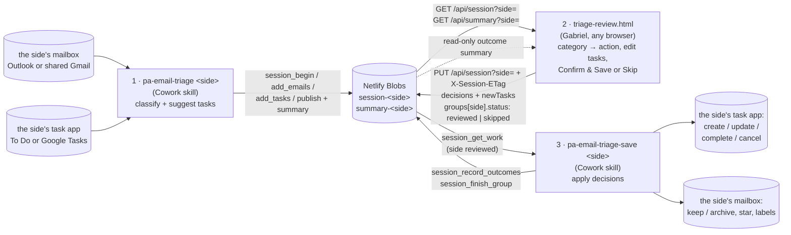

# PA Email Triage — review page

`public/triage-review.html` is a single static page: **step 2 of a three-step email-triage loop**. Claude proposes what to do with each email (step 1), Gabriel reviews and confirms on this page (step 2), Claude applies the confirmed decisions to the task apps and the mailboxes (step 3). The page, the session store and the skills' connector are **one Netlify site** — push the branch Netlify builds from and it deploys.

**Live:** https://pa-email-triage.netlify.app (`/` redirects to `/triage-review.html`)

| URL | Shows |
|---|---|
| `triage-review.html` (or `?type=gabriel-arina`) | Gabriel & Arina |
| `triage-review.html?type=gabriel` | Gabriel |
| `rules.html` / `rules.html?type=gabriel` | that side's triage rules |

One side per page, never both. Any other `?type=` is an error, not a fallback.

Works in any browser, phones and iPads included. **Sign in with Google** — only the one address in `ALLOWED_EMAILS` gets in; the sign-in lasts 30 days per browser.

---

## 1. The loop and the two skills

There are **two sides**, each with its own three records in Netlify Blobs (store `triage`): `session-<side>` (the session; `draft-<side>` while step 1 builds it), `context-<side>` (the triage rules, §6) and `summary-<side>` (step 1's run summary). `gabriel` = Outlook + Microsoft To Do, `gabriel-arina` = the shared Gmail + Google Tasks. The pages reach them through `/api/session`, `/api/context`, `/api/summary` (each with `?side=`); the two skills through the `triage-session` MCP connector (`/mcp/<secret>`), where every tool takes a required `side`. Nothing else touches the store, and the sides never wait for each other. The loop below runs once per side.

```mermaid
flowchart LR
    MB0[(the side's mailbox<br/>Outlook or shared Gmail)] --> T
    TK[(the side's task app<br/>To Do or Google Tasks)] --> T
    T["1 · pa-email-triage &lt;side&gt;<br/>(Cowork skill)<br/>classify + suggest tasks"]
    T -- "session_begin / add_emails /<br/>add_tasks / publish + summary" --> F[("Netlify Blobs<br/>session-&lt;side&gt;<br/>summary-&lt;side&gt;")]
    F -- "GET /api/session?side=<br/>GET /api/summary?side=" --> P["2 · triage-review.html<br/>(Gabriel, any browser)<br/>category → action, edit tasks,<br/>Confirm & Save or Skip"]
    P -- "PUT /api/session?side= + X-Session-ETag<br/>decisions + newTasks<br/>groups[side].status: reviewed | skipped" --> F
    F -- "session_get_work<br/>(side reviewed)" --> S["3 · pa-email-triage-save &lt;side&gt;<br/>(Cowork skill)<br/>apply decisions"]
    S --> TK2[(the side's task app:<br/>create / update /<br/>complete / cancel)]
    S --> MB[(the side's mailbox:<br/>keep / archive, star, labels)]
    S -- "session_record_outcomes<br/>session_finish_group" --> F
    F -. "read-only outcome summary" .-> P
```

| Step | Who | Reads | Writes | `groups[side].status` after |
|---|---|---|---|---|
| 1. Triage | **pa-email-triage** (Cowork skill), per side | the side's context (`context_get`), inbox and open tasks | a **draft** (`session_begin`, `session_add_emails`, `session_add_tasks`), then `session_publish` makes it the live session and stores the run summary | `pending-review` |
| 2. Review | **this page** (Gabriel) | `GET /api/session?side=`, `GET /api/summary?side=` | `PUT /api/session?side=`: `decision` blocks, `newTasks`, `groups[side]` | `reviewed` (Confirm & Save) or `skipped` (Skip) |
| 3. Save | **pa-email-triage-save** (Cowork skill), per side | `session_status` gate: the side must not be `pending-review`; then `session_get_work` when it is `reviewed` | the side's task app (create/update/complete/cancel) and mailbox (keep or archive, star, labels); `session_record_outcomes` + `session_finish_group` | `processed` or `processed-with-errors`; `skipped` stays `skipped` |

**Input** of the page = the side's session as published by pa-email-triage. **Output** = the same session with `decision` blocks, `newTasks` and `groups[side].status: "reviewed"` or `"skipped"` — which is the entire input of pa-email-triage-save for that side. **The sides are independent**: Gabriel can be reviewed and saved while Gabriel & Arina has not even been prepared. **There is no session-level status** — `groups[side].status` is the only one, and `groups` has only the side's key. The page reads and writes the session only through `/api/session?side=` (its other calls are `/api/summary` and `/api/context`, §6); the whole JSON is loaded, mutated in place and written back, so every field it does not know about is preserved — and the server enforces who may change what (§4).

The two sides:

| Mailbox | `email.source` | Side / page | Task backend (`provider`) |
|---|---|---|---|
| Gabriel's Outlook | `outlook` | **Gabriel** | Microsoft To Do (`todo`) |
| Gabriel & Arina Gmail | `gmail` | **Gabriel & Arina** | Google Tasks (`gtasks`) |

One backend per mailbox, no cross-posting, no list picking. A session only ever holds its side's emails and tasks — the server refuses the other side's. A task's identity is its `key` (`"<provider>:<listId>:<taskId>"`); an email points at one with `existingTaskKey`. There are no groups and no task tags.

The triage **rules** (who matters, what to track and ignore, which Gmail labels exist) live in the same site — see §6.

---

## 2. Screens

- **Landing** — **Sign in with Google** (full-page redirect, the side survives it). A signed-in browser goes straight to the side's session; no session yet → "No <side> session yet — run pa-email-triage for <side>."; an unknown `?type=` → an error naming the two valid links, nothing loaded; a Google account that is not allowed → "This Google account is not allowed." The header has **Reload** (re-fetch; in-memory edits on pending tabs are lost) and **Sign out** (this browser only).
- **Run summary** — a collapsible panel under the tab with the summary pa-email-triage stored with this session (`/api/summary?side=`); hidden when there is none.
- **Review** (`pending-review`):
  1. **Emails** — from, subject, date/age, Claude's summary, 🚩 if `isFlagged`, source badge, deep link (`suggestedTask.link`, else built from `id`: `outlook.live.com/mail/0/inbox/id/…` or `mail.google.com/mail/u/0/#inbox/…`). Filter by category. Each row has a **Category** ribbon and an **Action** ribbon (§3). Emails already matched to a task show **✓ Tracked** instead of a category. Each head's from-line carries a **sender chip** (§6).
  2. **Open tasks** of the side (To Do or Google Tasks) — Open / Done / Cancelled select + **Edit** (task editor with live diff against the task as fetched).
  3. **New tasks** — **+ Add task**; editable/deletable until confirmed.
  4. **Sticky bar** — counts for the tab (tasks to create / to flag / to archive / task updates, done, cancelled, edited, new), **Skip — <tab>** and **Confirm & Save — <tab>**.
- **Reviewed** (`reviewed`) — read-only "waiting for pa-email-triage-save".
- **Skipped** (`skipped`) — read-only "pa-email-triage-save will leave it alone", with a **Reopen for review** button that puts the tab back to `pending-review` (only possible while the save skill hasn't run).
- **Processed** (`processed` / `processed-with-errors`) — read-only outcome list: one row per email, existing task and new task with the outcome the save skill stamped (first of `outcome | result | applied | processed` on the item; text containing "fail" is red). Without an outcome field the badge falls back to the decision ("Archive", "completed", "created"…).

The header also has a **Rules** link to `rules.html` (§6). Light/dark toggle, remembered in `localStorage` (`triage-theme`, shared by both pages).

---

## 3. Decision model

**The category is the only thing Gabriel decides; it drives the action, and the action is exactly what the save skill will do.** Both are one-click icon ribbons, never dropdowns; there is no "undecided" state, so Confirm is always available. Changing the category resets the action to that category's default.

### Emails without a task

| Category | Actions (first = default) |
|---|---|
| Not Important | `archive` (locked) |
| FYI | `flag` (keep in inbox) · `archive` |
| Important | `create-task` · `flag` (keep in inbox, no task) |

Every email ends up either **kept in the inbox** or **archived** — there is no leave-alone and no create-email. `flag` (shown as "Keep in inbox"), `create-task` and `update-task` keep it in the inbox; `archive`, `complete-task` and `cancel-task` archive it.

The **star (Gmail) / flag (Outlook) is its own property** — a toggle beside the action ribbon that writes `decision.flagged` (default = the mailbox's current `isFlagged`; no action ever changes it, so "Keep in inbox" leaves an unflagged email unflagged). It is independent of the action: an archived email can stay starred. Gmail rows also show the message's **system labels** (Important, Updates, Promotions…) as muted read-only chips next to the editable user labels.

- `create-task` — the task created is `decision.task` (Gabriel's edit) → else `suggestedTask` (Claude's) → else a **fallback** from subject + summary, built on Confirm. It goes to the mailbox's backend (Gmail → Google Tasks, Outlook → To Do). **Edit task** opens the editor (title, your notes, due date); **Reset** returns to the suggestion. The email deep link is carried on the task automatically. The `Mount:` / `Arura:` / `Huberts:` title prefix (from the email's `properties/*` label) is shown as a hint and applied only to a fallback task.
- `flag` / `archive` — nothing under the ribbon.

### Emails with a task (`existingTaskKey` set)

No category. Actions: `update-task` (default) · `complete-task` · `cancel-task`. A matched task that is already completed is read-only end to end: `archive` is the only action.

- `complete-task` / `cancel-task` also archive the email; both save the task as completed, Cancelled adds a "Cancelled DD Mon: …" line.
- Complete/cancel is **mirrored** both ways with the matched task (`existingTasks[].decision.complete / .cancel`): Done/Cancelled on the task sets the action on every email matched to it, and vice versa.
- A head that is `newInThread` repoints the task's link at itself (`edits.link`, shown as "link → latest email").
- **Open & edit task** jumps to the editor for the matched task.

### Task description = Gabriel's notes + Claude's auto block

Two plain-text sections:

- **`-- notes`** — Gabriel's own text; the only half the editor exposes.
- **`-- auto --`** — written by pa-email-triage on every run (one-line brief, a dated line per message, latest-email link, `[triage]` footer); shown muted and read-only.

`decision.edits.notes` is always the whole new description (both halves).

### Existing-task edits

**Task titles are written once, at creation** — the title of an existing task is read-only. The editor records only **changed** fields versus the task as fetched: `decision.edits = { notes?, dueDate?, link? }` (never `title`), or `null` if nothing changed. It shows a live diff (unchanged muted, added green, removed red).

### Hard rules

- The tab decides the backend: Gabriel → To Do, Gabriel & Arina → Google Tasks. New tasks take the provider of the tab they are added on.
- `decision.isTask` is derived: `true` only when `emailAction === "create-task"`.

---

## 4. Confirm & Save / Skip

**The session is written only here.** Editing decisions on the page changes nothing in the store until you press one of the two buttons in the sticky bar. Both go through `writeGroupStatus()`:

1. `materializeDecisions()` — syncs derived fields, builds fallback tasks for Important emails without one, makes every child decision explicit.
2. **Stale-tab guard** — re-reads the session (`GET`, keeping its `ETag`) and refuses to write if the side is no longer `pending-review` (a forgotten old tab cannot clobber a reviewed/skipped/processed session): toast `Not saved — <side> is already "<status>". Reload to see it.`
3. Sets `groups[side] = { status: "reviewed" | "skipped", reviewedAt: <ISO>, processedAt: null }` (`reviewedAt` = when Gabriel decided, for both buttons); the page becomes read-only. A **skipped** side keeps its drafted decisions in the session (the save skill ignores them) and offers **Reopen for review**, which writes it back to `pending-review` (guard: still `skipped`) with `reviewedAt: null`.
4. `PUT /api/session` with `If-Match: <etag>`. The server checks the sign-in, the `Origin`, the contract and **ownership** (the page may only change `decision` blocks, `newTasks` and its own status moves — never `outcome` or `processedAt`), then writes with the same etag condition. `412` (the session changed in any way since the re-read) → "Not saved — session changed. Reload."; `401` (sign-in expired) → "Signed out — sign in and press again" and a header **Sign in** link that opens a new tab, so in-memory edits survive. On any failure the group status is rolled back so the UI stays editable.

`pa-email-triage-save` refuses to touch a side that is still `pending-review`, so every session ends confirmed or skipped. The other side plays no part.

A side that is `processed` / `processed-with-errors` shows its read-only outcome summary instead of the review UI.

The page never writes `processedAt` or per-item outcome fields — those belong to the save skill.

---

## 5. Session contract

**The JSON is defined in exactly one place: [`triage-session.schema.jsonc`](triage-session.schema.jsonc)** (this repo). It is an annotated example of the whole session — every key, which step writes it, the action vocabulary, the group lifecycle, the Gmail-labels rule and the per-step checklists. `netlify/lib/contract.ts` is its zod mirror and is what the server enforces; if they disagree, the schema file wins and the zod gets fixed. When the page changes what it reads or writes, change the schema file, then the code. All three steps (pa-email-triage, this page, pa-email-triage-save) follow it — the skills through the connector tools (`session_status`, `session_begin`, `session_add_emails`, `session_add_tasks`, `session_publish`, `session_get_work`, `session_record_outcomes`, `session_finish_group`, `context_get`, `summary_get` — every one with `side`), never the whole JSON.

Top-level keys, for orientation only: `side`, `generatedAt`, `mailboxes`, `gmailLabels`, `groups.<side>` (the only status in the session), `emails[]`, `existingTasks[]`, `newTasks[]`.

**Loading rules** (`applyLoadDefaults`): only what pa-email-triage may omit is filled in — missing `decision` / `existingTasks` / `newTasks` are created and an action that is missing or not allowed for that email is derived (from the matched task's Done/Cancelled if tracked, else the category default). The page only ever sees a session that `session_publish` accepted, so there is no legacy handling and no migration.

### What pa-email-triage must produce

Per side: `side`, `generatedAt`, `groups[side]` `pending-review`, `gmailLabels` (`[]` for gabriel), `emails[]` (only that side's) with `id`, `source`, `threadId`, `threadRole`, `inInbox`, `summary` (Gmail: `labels`), and on each head a `category` plus either `existingTaskKey` (the `key` of an entry in `existingTasks[]`) or an optional `suggestedTask`. `existingTasks[]` carry the current Google Tasks / To Do values. `decision` blocks may be omitted — the page fills them. It reads its rules with `context_get` (§6).

### Gmail labels are email-only

Gmail user labels belong to the email, not the task: `labels` (now) and `decision.labels` (wanted). The head row shows the wanted labels as chips (× removes, **+ label** adds from `gmailLabels` ∪ already set). Their only task-side effect is the title prefix of a fallback task. The save skill applies the diff (`labels` → `decision.labels`) to Gmail. Outlook emails have no labels.

### What pa-email-triage-save must honour

- **One side per run** ("both" = two runs, Gabriel first). **Gate first:** if `groups[side].status` is `pending-review`, stop for that side and touch nothing — Gabriel must Confirm or Skip it first.
- When `status === "reviewed"`, apply the side's items. Never touch a side that is `skipped` (its `decision` blocks are drafts Gabriel chose not to apply — leave the status `skipped`) or already `processed`.
- After processing, `session_finish_group` sets `groups[side].status` to `"processed"` / `"processed-with-errors"` and stamps `processedAt`. Never write a session-level `status`.
- Gmail emails of a reviewed `gabriel-arina` session (every action, archive included): add `decision.labels − labels`, remove `labels − decision.labels`.
- Email actions decide inbox vs archive only: `archive` → archive; `flag` → keep in inbox; `create-task` → create the task from `decision.task ?? suggestedTask` (the page guarantees one of them) in the mailbox's backend, keep in inbox; `update-task` → apply the matched task's `decision.edits`, keep in inbox; `complete-task` / `cancel-task` → complete the task (cancel adds a "Cancelled DD Mon: …" line) **and** archive the email. Never delete, never reply.
- Star/flag, every email of a reviewed session: `decision.flagged !== isFlagged` → Gmail add/remove `STARRED` / Outlook `flag_email` flagged / notFlagged; equal → nothing. Never touch `systemLabels`.
- Existing tasks: re-read the live task, apply `edits` (only `notes` / `dueDate` / `link`, never a title; keep the `[triage]` footer), then `complete` / `cancel`. A task already completed is left alone.
- `newTasks`: create each in the backend named by its `provider`.
- Stamp a string outcome on each processed item (`outcome`, via `session_record_outcomes`), plus the status described above.

---

## 6. Triage rules — `rules.html`, sender chip, `/api/context`

The **triage context** is what pa-email-triage follows when it classifies: properties, tracked senders, the Gmail label registry + label guide, tracked topics, the ignore list, free-form rules and run settings. There is **one per side** (Blobs keys `context-gabriel`, `context-gabriel-arina`) — it replaces the old `task-context.md`. It is **separate from the session** — editing it never changes the review on screen; it applies from the next pa-email-triage run.

- **`rules.html`** ("Triage Rules — <side>", header **Rules** link keeps the side; `?type=gabriel` for Gabriel, no parameter for Gabriel & Arina; deep links such as `rules.html?type=gabriel#senders`) — tabs **Senders**, **Properties**, **Gmail labels** (+ label guide), **Topics**, **Ignore list**, **Rules** (ordered, each on/off), **Run settings**, **History** (view or restore any replaced version). Every change saves at once: re-read, apply, `PUT`; a `412` re-applies the same change to the fresh copy (3 attempts), so two open pages never overwrite each other. Sign-in from this page returns to it (`/api/auth/login?type=rules` / `rules-gabriel`).
- **Sender chip** on the review page — after each head's sender: `👤 relationship · P# property` when the sender matches a rule (exact address first, then `@domain`), else **+ sender rule**; an amber **ignored** chip when the sender is on the ignore list. Clicking opens the **Sender rule** panel (name, addresses / `@domains`, relationship, property, Gmail label, notes, **Ignore this sender**, **Add a rule**). **Confirm** saves to the context immediately, the same way as the Rules page. Disabled on locked tabs.
- **`/api/context?side=`** (signed in) — `GET` → that side's context + `X-Context-ETag` (`404` if never loaded); `&history` → replaced versions, newest first; `&version=<key>` → one of them. `PUT` replaces the whole document with `X-Context-ETag` (`428` missing, `412` stale, `422` invalid with `details[]`, `403` bad `Origin`); the server stamps `updatedAt` / `updatedBy`, keeps the replaced version under `context-history/<side>/<iso>` and prunes to the newest 50. `PUT` never creates — each side's first copy is loaded once with `netlify blobs:set triage context-<side> --input <file>`.
- **`context_get { side }`** (connector, read-only) — `format: "markdown"` (default) → `{ side, updatedAt, markdown }`, the document step 1 follows; `"json"` → the raw context. `NO_CONTEXT` if that side has none.

The real context names people, addresses and properties — it never goes in this repo; tests use a synthetic one.

---

## 7. Repo contents

| File | Purpose |
|---|---|
| `triage-session.schema.jsonc` | Annotated example of the session — the single contract every skill and the page must follow |
| `public/triage-review.html` | the review page — vanilla JS + CSS in one file |
| `public/rules.html` | the Triage Rules page — same conventions |
| `netlify/lib/` | `contract.ts` (zod mirror of the schema), `session-ops.ts` (pure session logic), `context.ts` (triage context: zod schema, checks, markdown rendering), `summary.ts` (run summary shape), `store.ts` (Blobs), `auth.ts` (cookie, env) |
| `netlify/functions/` | `/api/auth/login`, `/api/auth/callback`, `/api/auth/logout`, `/api/session`, `/api/context`, `/api/summary`, `/mcp/:secret` |
| `test/` | `node --test` unit tests + **synthetic** fixtures (never real mail or a real context) |
| `netlify.toml`, `package.json`, `tsconfig.json` | site config, the six dependencies, strict TypeScript (`noEmit`) |
| `CLAUDE.md` | guidance for Claude Code (decision model, contract, editing tips) |
| `improvements.md` | backlog + change log — add to it for deliberate UX changes |
| `improvements/` | the functional / technical spec and runbook of the Netlify move |
| `.mcp.json` | Outlook MCP server used by Claude Code in this repo |

Environment variables (Netlify UI, never in the repo): `GOOGLE_CLIENT_ID`, `GOOGLE_CLIENT_SECRET`, `ALLOWED_EMAILS`, `SESSION_SECRET`, `MCP_SECRET`. Checks: `npx tsc --noEmit`, `node --test`, and `node --check` on each page's extracted `<script>`. Local run: `npx netlify dev` on `http://localhost:8888` (needs `netlify link`; the emulated store is per machine). The earlier Next.js app (Apr–Aug 2026), the `localhost:8765` server scripts and the local-file / File System Access version of the page (Aug–Sep 2026) remain in git history only.
