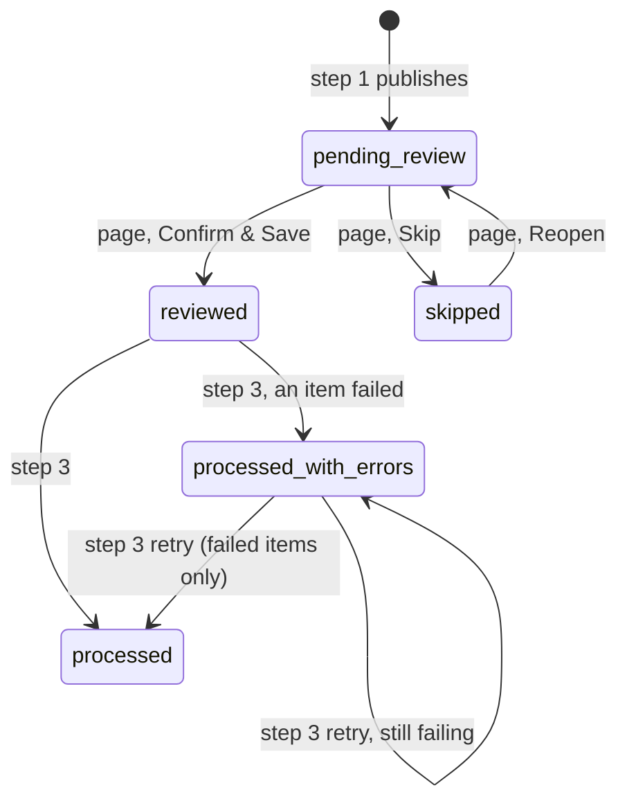

# PA Email Triage — functional spec

The whole system in one place: the two Cowork skills (steps 1 and 3), the review page (step 2), the rules page, the store and the connector. The session JSON is specified key by key in [`../triage-session.schema.jsonc`](../triage-session.schema.jsonc) — **the contract wins over this file and over the code**. Guidance for Claude Code is in [`../CLAUDE.md`](../CLAUDE.md); the one-page summary is [`../README.md`](../README.md).

**Live:** https://pa-email-triage.netlify.app (`/` → `/triage-review.html`) · one Netlify site: two static pages, a few Functions, Netlify Blobs. Push `master` and it deploys — no build step.

Mailbox addresses, real senders and the real triage context are deliberately **not** in this repo (it is public). They live in the triage context (Blobs) and in the skill masters kept outside the repo.

---

## 1. What it does

A three-step email-triage loop that turns an inbox into tasks, run **per side**:

1. **`pa-email-triage`** (Cowork skill) reads the side's inbox and task app, classifies every thread, suggests tasks, and publishes a session plus a run summary. Read-and-suggest only.
2. **`triage-review.html`** — Gabriel reviews on any browser (phones, iPads included), then **Confirm & Save** or **Skip**.
3. **`pa-email-triage-save`** (Cowork skill) applies the confirmed decisions to the task app and the mailbox, and stamps outcomes.

A second page, **`rules.html`**, edits the triage rules step 1 follows.

Nothing in the loop ever deletes, replies to or sends an email, and nothing ever deletes a task.

### 1.1 Moving parts

```
 Gabriel's PC / Cowork                         Netlify (pa-email-triage.netlify.app)                 Browser
 ─────────────────────                         ─────────────────────────────────────                 ───────
 pa-email-triage (skill) ──┐                   /mcp/<secret>  (functions/mcp.ts)                    triage-review.html
 pa-email-triage-save ─────┼── triage-session ─►  "triage-session" MCP server ──┐                  rules.html
   (skills on claude.ai)   │   connector           10 tools, every one takes side │                     │
                           │                                                      ▼                     │ fetch (cookie)
   reads/writes mail       │                   Netlify Blobs, store "triage" ◄── functions/lib ◄── /api/session
   and tasks directly:     │                     session-<side>  draft-<side>                       /api/summary
     outlook-mcp ──────────┤ (local, stdio)      summary-<side>  context-<side>                     /api/context
     gabrielandarina-      │                     context-history/<side>/<iso>                       /api/auth/*
       google-tasks ───────┤ (local, stdio)                                                            │
     Gmail connector ──────┘ (claude.ai)                                                    Google sign-in (OAuth)
```

| Part | What it is | Where it runs | Where its code / config sits | Talks to |
|---|---|---|---|---|
| **`pa-email-triage`** (step 1) | Claude skill: prepare a side's session | Cowork / Claude Code, on Gabriel's PC | Uploaded to claude.ai (skill settings). Master copy kept with the project notes: `PA/Email Triage/_docs/pa-email-triage.SKILL.md` — not in this repo, it names the mailboxes | the mailbox + task MCPs below (read only), the `triage-session` connector |
| **`pa-email-triage-save`** (step 3) | Claude skill: apply a reviewed session | same | claude.ai; master `PA/Email Triage/_docs/pa-email-triage-save.SKILL.md` | the mailbox + task MCPs (write), the `triage-session` connector |
| **`outlook-mcp`** | Outlook mail **and** Microsoft To Do for side `gabriel` | local stdio MCP server on Gabriel's PC | its own folder under Gabriel's `mcp-server` directory; registered in the user's Claude Code config | Microsoft Graph |
| **`gabrielandarina-google-tasks`** | Google Tasks for side `gabriel-arina` | local stdio MCP server on Gabriel's PC | same | Google Tasks API |
| **Gmail connector** (`mcp__Gmail__*`) | the shared Gmail for side `gabriel-arina` | claude.ai built-in connector | claude.ai connector settings | Gmail API. (`gmail-emails`, Gabriel's personal Gmail, is never used by triage) |
| **`triage-session` connector** | the only door from the skills to the stored data | Netlify Function `netlify/functions/mcp.ts` at `/mcp/<MCP_SECRET>` | this repo; added in claude.ai as a custom connector with that URL | Netlify Blobs |
| **Review page** | step 2 | any browser | `public/triage-review.html` | `/api/session`, `/api/summary`, `/api/context`, `/api/auth/*` |
| **Rules page** | edits a side's triage context | any browser | `public/rules.html` | `/api/context`, `/api/auth/*` |
| **HTTP API** | the pages' only door to the stored data | Netlify Functions | `netlify/functions/{session,summary,context,auth-*}.ts` | Netlify Blobs, Google OAuth |
| **Netlify Blobs** | all stored data — sessions, drafts, summaries, contexts, context history | Netlify, site `pa-email-triage`, store `triage` | read/written only through `netlify/lib/store.ts` | — |

**Rules of the road:** the skills never touch the pages or Blobs directly — only the connector. The pages never call a mailbox or task app — only `/api/*`. Only the Functions touch Blobs. There is **no local file** anywhere in the loop (no `triage-session.json`, no `triage-summary.md`, `task-context.md` is a pointer only).

### 1.2 Where each thing lives — and how to look at it

Everything is a JSON document in Netlify Blobs, store **`triage`**, one set per side (§7). Ways to see it, easiest first:

| Thing | Blobs key | Written by | See it in the app | See it in Claude | See it raw (CLI, from this repo after `netlify link`) |
|---|---|---|---|---|---|
| **Run summary** | `summary-<side>` → `{ side, generatedAt, publishedAt, markdown }` | step 1, via `session_publish { side, summary }` | review page → **Run summary** panel; or `/api/summary?side=<side>` while signed in | `summary_get { side }` | `npx netlify blobs:get triage summary-gabriel` |
| **Live session** | `session-<side>` | step 1 (`session_publish`), page (`PUT /api/session`), step 3 (outcome tools) | the review page; or `/api/session?side=<side>` | `session_status { side }` (counts only) | `npx netlify blobs:get triage session-gabriel-arina` |
| **Draft** (step 1 in progress) | `draft-<side>` | `session_begin` / `session_add_*`; deleted on publish | — | `session_status` → `draft` | `npx netlify blobs:get triage draft-gabriel` |
| **Triage rules (context)** | `context-<side>` | `rules.html` and the sender panel (`PUT /api/context`) | `rules.html` (G&A) / `rules.html?type=gabriel`; or `/api/context?side=<side>` | `context_get { side }` (markdown, or `format: "json"`) | `npx netlify blobs:get triage context-gabriel` |
| **Rules history** | `context-history/<side>/<iso>` (newest 50) | `PUT /api/context`, the version it replaced | `rules.html` → **History** tab (view / restore) | — | `npx netlify blobs:list triage --prefix context-history/gabriel/` |

`npx netlify blobs:list triage` lists every key. The Netlify UI (site → Blobs) shows the same store. Add `-O <file>` to `blobs:get` to save to a file — save it **outside** the repo; real sessions and contexts never go in it.

### 1.3 How the two sides are told apart

One value, **`side`** — `gabriel` or `gabriel-arina` — carried end to end. Nothing infers it.

| Layer | How the side is chosen | Enforced by |
|---|---|---|
| Skill | Gabriel names it ("Gabriel", "Gabriel & Arina" / "G&A" / "us" / "shared", or "both"); otherwise the skill asks. It then uses only that side's mailbox and task app (table §2) | the skill text |
| Connector | `side` is a **required** argument on all 10 tools | `mcp.ts` (zod) — missing / unknown → error |
| Page | URL `?type=`: none or `gabriel-arina` → G&A; `gabriel` → Gabriel; anything else → error, nothing loaded. Survives sign-in (`/api/auth/login?type=gabriel | rules | rules-gabriel`) | the page + `auth.ts` (`pageType`, `landingFor`) |
| HTTP API | `?side=` required on `/api/session`, `/api/summary`, `/api/context` → `400` without it | `parseSide` in `contract.ts` |
| Storage | the side is part of every key: `session-<side>`, `draft-<side>`, `summary-<side>`, `context-<side>`, `context-history/<side>/…` | `store.ts` (`DocKey` type) |
| Session content | top-level `side`; `groups` has exactly that one key; every email's `source` and every task's `provider` must belong to it (`outlook` / `todo` → `gabriel`, `gmail` / `gtasks` → `gabriel-arina`) | `checkSession` / `groupOf` in `contract.ts`; `appendEmails` / `appendTasks` refuse the other side's items |
| Rules | each side has its own context document; `context_get` renders it with a line naming the side | `context.ts` (`renderContextMarkdown(ctx, side)`) |

So the two sides cannot meet: different keys, different statuses, and the server refuses an item of the wrong side at every write.

### 1.4 One run, end to end (side `gabriel-arina`)

1. Gabriel: "email triage Gabriel & Arina".
2. Step 1 calls `context_get { side }` → reads `context-gabriel-arina`.
3. Step 1 reads Google Tasks (`gabrielandarina-google-tasks`) and the shared Gmail (Gmail connector) — read only.
4. Step 1 calls `session_status` → `session_begin` (creates `draft-gabriel-arina`) → `session_add_emails` / `session_add_tasks` in batches of ≤ 25 → `session_publish { side, summary }`. The server validates, writes `session-gabriel-arina` (status `pending-review`) and `summary-gabriel-arina`, and deletes the draft.
5. Gabriel opens `https://pa-email-triage.netlify.app`, signs in with Google. The page calls `GET /api/session?side=gabriel-arina`, `/api/summary?…`, `/api/context?…`.
6. Gabriel decides, then **Confirm & Save** → `PUT /api/session?side=gabriel-arina` → status `reviewed`.
7. Gabriel: "save my triage Gabriel & Arina". Step 3 calls `session_status` → `session_get_work` (pages) → writes to Google Tasks and Gmail → `session_record_outcomes` → `session_finish_group` → status `processed`.
8. Gabriel reloads the page → read-only outcomes.

Side `gabriel` is the same with `outlook-mcp` for both mail and To Do, and the page at `?type=gabriel`.

## 2. Two sides, never mixed

| Side | Mailbox (`source`) | Task app (`provider`) | Review page | Rules page |
|---|---|---|---|---|
| `gabriel` | Outlook (`outlook`) | Microsoft To Do (`todo`) | `triage-review.html?type=gabriel` | `rules.html?type=gabriel` |
| `gabriel-arina` | shared Gmail (`gmail`) | Google Tasks (`gtasks`) | `triage-review.html` (or `?type=gabriel-arina`) | `rules.html` |

- One side per page. Any other `?type=` value → error on the landing card, nothing loaded — never a fallback, never both sides on one page. The side survives sign-in.
- Each side has its own session, context, run summary and status. Begin, publish, review and save of one side never look at or wait for the other.
- One backend per mailbox, default list only, no list picking, no cross-posting. A session holds only its side's items — the server refuses the other side's.
- **Task identity:** `key` = `"<provider>:<listId>:<taskId>"`; an email points at one with `existingTaskKey`; `url` is an optional display link and may be null. A thread is linked to its task **only** by the footer at the end of the task notes: `[triage] thread=<threadId> src=gmail|outlook` (To Do also carries the threadId in `linkedResources[0].externalId`). No group, no tags, no source id on tasks.
- **Skills:** each takes "Gabriel", "Gabriel & Arina" (also "G&A", "us", "shared") or "both". Nothing named → one short question before calling anything. "Both" = `gabriel` first, then `gabriel-arina`, as two independent runs reported under separate headings; one side failing never stops the other.

## 3. Status lifecycle

`groups[side]` = `{ status, reviewedAt, processedAt }` is the only status in a session (no session-level status; `groups` has exactly the side's key).



| Move | Only by |
|---|---|
| new session (`pending-review`) | step 1; refused while the live session is `pending-review` / `reviewed` unless `discard: true` (only after Gabriel says so) |
| `pending-review → reviewed / skipped`, `skipped → pending-review` | the page |
| `reviewed / processed-with-errors → processed / processed-with-errors` + `processedAt` | step 3 |

`skipped` stays `skipped` — step 3 never touches it. Anything else is refused by the server.

### Who owns what in the session

| Keys | Written by |
|---|---|
| emails, `existingTasks`, `mailboxes`, `gmailLabels`, `generatedAt`, `side` | step 1, only into a draft |
| `decision` blocks, `newTasks`, `reviewedAt`, status moves `reviewed` / `skipped` / `pending-review` | the page |
| per-item `outcome`, status `processed` / `processed-with-errors`, `processedAt` | step 3 |

---

## 4. Step 1 — `pa-email-triage` (prepare)

Read-and-suggest only: creates, updates or completes no task; flags, stars, archives, moves, deletes or replies to nothing; adds, removes or creates no Gmail label. Never launches the page. If the `triage-session` connector is unavailable → stop and say so; never a local session file. If the side's task app or mailbox can't be fetched → stop that side before `session_begin` (otherwise every tracked thread looks new and produces duplicates).

**Calls and data at a glance**

| | `gabriel` | `gabriel-arina` |
|---|---|---|
| Rules read from | `context_get { side: "gabriel" }` → Blobs `context-gabriel` | `context_get { side: "gabriel-arina" }` → `context-gabriel-arina` |
| Tasks read from | `outlook-mcp`: `list_task_lists`, `list_tasks`, `get_task` (Microsoft To Do, default list) | `gabrielandarina-google-tasks`: `list_task_lists`, `list_tasks` (Google Tasks, default list) |
| Mail read from | `outlook-mcp`: `list_emails`, `search_emails`, `read_email` | Gmail connector: `list_labels`, `search_threads`, `get_thread`, `get_message` |
| Session written to | connector `session_begin` / `session_add_emails` / `session_add_tasks` → Blobs `draft-gabriel`; `session_publish` → `session-gabriel` | same → `draft-gabriel-arina` → `session-gabriel-arina` |
| Run summary written to | `session_publish { side, summary }` → Blobs `summary-gabriel` | → `summary-gabriel-arina` |
| Writes to mailbox / task app | none | none |
| Output in chat | counts + the page link `…/triage-review.html?type=gabriel` | counts + `https://pa-email-triage.netlify.app` |

### 4.1 Read the side's triage context

`context_get { side }` → `{ side, updatedAt, markdown }`. Sections used: properties, senders (addresses and `@domains`, relationship, property, notes), tracked topics (keywords that force a task), ignore list, rules (free-form, followed literally) and run settings. The Gmail label section is for the page and step 3. `NO_CONTEXT` → stop that side. An existing but empty context (a new side) → run on the generic heuristics and say so.

**Precedence:** rules > senders > tracked topics > ignore list > generic heuristics. A sender's notes and relationship inform the classification and wording, never copied into a task verbatim. One task per thread, always.

### 4.2 Fetch the side's tasks (before any email work)

Default list, completed included.

- **Google Tasks** (`gabriel-arina`): `list_task_lists` → `list_tasks` (`status: all`, `show_completed`). `key = gtasks:<listId>:<taskId>`.
- **Microsoft To Do** (`gabriel`): `list_task_lists` → `list_tasks` (`includeCompleted`) — returns `key`, `status`, `dueDate`, `link`, `threadId`.

Each becomes an `existingTasks[]` entry with exactly: `key`, `provider`, `listId`, `listName`, `url`, `title`, `notes`, `status` (`needsAction` | `completed`), `dueDate` (`YYYY-MM-DD` or `""`), `link`, `threadId`. `threadId` comes from the `[triage]` footer; no footer = **manual task**: `threadId: null`, listed, never matched, notes copied exactly. Titles are copied verbatim and never re-proposed.

### 4.3 Fetch the side's inbox, thread-aware

- **Gmail** (`gabriel-arina`): `list_labels` once → user labels into `gmailLabels` (failure → `[]`, reported). `search_threads in:inbox` (50), then `get_thread` for every thread so **every message** is present, archived ones and Gabriel's replies included. Per message: `id`, `sourceId = gmail:<id>`, `from`, `subject`, `date`, deep link, `threadId`, `inInbox` (`INBOX` in its labels), `isFlagged` (`STARRED`), `labels` (user labels) and `systemLabels` (every other label minus `INBOX` / `STARRED`, raw names — read-only).
- **Outlook** (`gabriel`): `list_emails` inbox (50); `threadId` = `conversationId`; pull the rest of each conversation from every folder. `inInbox` = sits in Inbox, `isFlagged` = `flagStatus === "flagged"`, `sourceId = outlook:<raw id>`. No `labels` / `systemLabels`.

**Threads:** only threads with at least one inbox message go in, but then all their messages do. The newest message by date is the `head` (exactly one per thread); the rest are `child`. `category`, `existingTaskKey`, `suggestedTask`, `newInThread` are head-only. Every message gets a one-line `summary`. Snippets are enough to classify; a body is read only when a tracked sender's ask is unclear or a rule needs it.

`isFlagged` must be the real state at fetch time — the page defaults `decision.flagged` from it and step 3 diffs the two.

### 4.4 Match threads to tasks

A head is **tracked** when a task's `threadId` equals the head's (same `src`) → `existingTaskKey` = that task's `key`. No fuzzy title matching. Tracked heads get no suggestion. `newInThread` = the head is newer than the message the task's `Latest email:` line points at (untracked heads: `false`). No two heads share an `existingTaskKey`.

### 4.5 Classify heads

First match wins:

1. Tracked → no suggestion (category still recorded).
2. Rule / tracked sender / tracked topic → suggest a task per the rule.
3. Already starred/flagged → suggest a task, `Important`.
4. Ignore list → no task, `Not Important`.
5. Generic heuristic → a task only for a clear ask (question, request, approval, bill, deadline, booking, decision). Newsletters, receipts, confirmations, marketing → no task.

Every head gets `Important` / `FYI` / `Not Important`. Judge the whole thread — an ask answered later is no longer an ask. Step 1 writes **no `decision` blocks**; the page derives them. No flagged email is classified below `Important`. Max 25 suggestions per run.

### 4.6 Suggested task (Important, untracked heads)

`{ title, notes, dueDate, link }`:

- **Title:** imperative, ≤ 80 chars, no `Re:` / `FW:`, no sender name as title. Prefixed `Mount: ` / `Arura: ` / `Huberts: ` when the email carries the matching `properties/*` Gmail label (case-insensitive); no other prefix, never double-prefixed, never re-applied to an existing task.
- **Link:** deep link to the head — mandatory.
- **Due date** (Australia/Sydney, date only): a stated deadline wins verbatim; otherwise

  | Kind of email | Due |
  |---|---|
  | bill, invoice, payment, renewal | stated date, else +7 days |
  | direct request or question from a person | +3 days |
  | property manager: repairs, entry notices, inspections | +3 days, or the inspection date |
  | booking, appointment, RSVP | the event date, else +2 days |
  | reading, research, anything vague | +7 days |

### 4.7 Task notes format

Plain text (Google Tasks has no formatting):

```
-- notes
<Gabriel's own text>

-- auto --
One line: what this is and what needs to be done.
DD Mon — one line per message of the thread, oldest first, newest 10 (… N earlier messages)
Latest email: <deep link to the head>
[triage] thread=<threadId> src=gmail|outlook
```

- Above `-- auto --` is Gabriel's: read it, use it, copy it byte-for-byte, never change it. New tasks get an empty `-- notes` section.
- Below is regenerated every run — for new tasks (`suggestedTask.notes`) and tracked tasks (`existingTasks[].notes`). The `[triage]` footer is never omitted: it is how the next run re-finds the task.
- Manual tasks keep their notes untouched.

### 4.8 Publish

1. `session_status { side }` — continue only if no session, or the side is `processed` / `processed-with-errors` / `skipped`. `pending-review` / `reviewed` → stop and ask: discard, or save first. `discard: true` only on Gabriel's say-so.
2. `session_begin { side, generatedAt, mailboxes, gmailLabels, discard? }` (`mailboxes` = `["outlook"]` / `["gmail"]`; `gmailLabels` = `[]` on `gabriel`).
3. `session_add_emails` / `session_add_tasks` — ≤ 25 per call. `VALIDATION:` → fix the named field and resend.
4. Write the run summary (§4.9).
5. `session_publish { side, summary }` — the server checks the whole draft, makes it live (`pending-review`, `newTasks: []`), stores the summary. `VALIDATION:` lists every problem → rebuild the draft and publish again.
6. Verify (`session_status` shows `pending-review`, `summary_get` returns the summary), report counts per side in chat (not the summary itself) and give the side's page link.

Never sent by step 1: `decision`, `outcome`, `processedAt`, `groups`, `newTasks`, a top-level `status`.

### 4.9 Run summary

Markdown, one side, built only from what was published plus which rule fired for each suggestion. Dates `DD MMM YYYY`, Sydney. Constants: `URGENT_DAYS` 3, `STALE_DAYS` 14, `NOTES_MAX` 200 chars.

- **Header** — `# Triage summary — <side> — <date, time>`; counts: emails / threads · tracked · new tasks · defaulting to archive; open tasks; "Rules: none yet for this side" when the context is empty.
- **1. New emails → suggested tasks** — untracked heads with a suggestion only: date — sender — linked subject (category, starred, label), summary, `→ Task: title · due · rule that fired`.
- **2. New mail on tracked tasks** — tracked heads with `newInThread`: task, app, due (+ overdue), the new email, then Gabriel's `-- notes` verbatim (cut at `NOTES_MAX`) or, if empty, the auto one-liner.
- **3. Urgent tasks** — open tasks due ≤ today + 3 (manual included), overdue first: `Task | Due | Status | New mail | App`.
- **4. Stale tasks** — open, not urgent, no due date or due > 14 days out, no new mail: `Task | Due | Last email | App | Your notes / auto`.

Sections 3 and 4 never overlap; every count equals the items printed. Shown on the review page's **Run summary** panel; step 3 never reads it.

---

## 5. Step 2 — the review page

**Where:** `public/triage-review.html`, served by Netlify. Side from `?type=` (§1.3).

**Load:** sign-in check → `GET /api/session?side=` → `GET /api/summary?side=` → `GET /api/context?side=`. No mailbox or task-app calls. Nothing is written until Confirm & Save or Skip.

| Reads | Writes |
|---|---|
| `session-<side>`, `summary-<side>`, `context-<side>` (all through `/api/*`) | `session-<side>` — only `decision` blocks, `newTasks`, its status (`PUT /api/session`); `context-<side>` — only through the sender panel (`PUT /api/context`) |

**Screens**
- **Landing** — Sign in with Google; "No <side> session yet — run pa-email-triage for <side>."; unknown `?type=` error; "This Google account is not allowed."
- **Header** — side name, version stamp, **Rules** link, **Reload** (drops in-memory edits), **Sign out**, light/dark toggle (`localStorage` `triage-theme`, shared with `rules.html`).
- **Run summary** — collapsible panel; hidden when there is none.
- **Review** (`pending-review`) — emails (one row per thread), open tasks, new tasks (**+ Add task**), sticky bar with counts, **Skip** and **Confirm & Save**.
- **Reviewed / Skipped** — read-only; Skipped offers **Reopen for review**.
- **Processed** — read-only outcome list per email / task / new task (failures in red; no outcome → the decision).

**Threads.** Only the head is interactive; children sit collapsed under it ("▸ N earlier messages"), read-only, marked "already archived" when `inInbox` is false. Child actions are derived from the head: head keeps it in the inbox → child `flag` if `inInbox`, else `archive`; head archives → child `archive`; children never flagged. Counts and filters count heads only.

### 5.1 Decision model

The **category** is the one choice; it drives the **action** (`decision.emailAction`), which is exactly what step 3 does. Both are one-click icon ribbons; there is no "undecided" state, so Confirm is always available.

| Head | Actions (first = default) |
|---|---|
| Not Important | `archive` (locked) |
| FYI | `flag` ("Keep in inbox") · `archive` |
| Important | `create-task` · `flag` |
| tracked (`existingTaskKey`), no category | `update-task` · `complete-task` · `cancel-task` |
| tracked, task already completed | `archive` only, everything read-only |

| Action | Thread | Task |
|---|---|---|
| `archive` | archive | — |
| `flag` | keep in inbox | — |
| `create-task` | keep in inbox | create |
| `update-task` | keep in inbox | apply `edits` |
| `complete-task` | archive | complete |
| `cancel-task` | archive | complete + `Cancelled DD Mon: …` line |

- **Star / flag** is separate: `decision.flagged` (toggle beside the action, default `isFlagged`). No action changes it.
- **Gmail labels** are email-only: `labels` (now) vs `decision.labels` (wanted). The row shows the wanted ones (× removes, **+ label** opens a searchable picker over `gmailLabels` ∪ already set). `systemLabels` are shown read-only, never written. Nothing label-like is mirrored onto a task.
- **`create-task`** uses `decision.task` → `suggestedTask` → a fallback built from subject + summary on Confirm. The title prefix is a hint, applied only to a fallback task.
- **Complete / cancel** mirror the matched task's Open / Done / Cancelled select (`existingTasks[].decision.complete / .cancel`).
- **Task titles are written once, at creation** — never `edits.title`. Existing-task edits record only what changed: `decision.edits = { notes?, dueDate?, link? } | null`, shown as a live diff.
- **Task descriptions** = `-- notes` (editable) + `-- auto --` (read-only). `edits.notes` is always the whole string.
- A `newInThread` head shows a "new email in thread" badge and points the matched task's `edits.link` at itself ("link → latest email").
- **Sender chip** on each head: the matching sender rule (address first, then `@domain`), "ignored", or **+ sender rule** → Sender rule panel, saved straight to the context (§8). Never touches the session.

### 5.2 Confirm & Save / Skip / Reopen

The only write path:

1. Fill derived fields (fallback tasks, explicit child decisions).
2. Re-read the session. Side no longer in the expected status → toast `Not saved — <side> is already "<status>". Reload to see it.`, nothing written.
3. Set `groups[side]` (`reviewed` / `skipped` with `reviewedAt`; Reopen → `pending-review`, `reviewedAt: null`) and lock the page.
4. `PUT /api/session?side=` with the whole session and `X-Session-ETag` from that re-read.
   - `412` → "Not saved — session changed. Reload."
   - `401` → "Signed out — sign in and press again" + a header **Sign in** link in a new tab (edits stay in memory).
   - Any failure rolls `groups` back so the page stays editable.

The page never writes `processedAt` or outcomes.

---

## 6. Step 3 — `pa-email-triage-save` (apply)

**Rule in one line:** every email ends up kept in the inbox or archived, and its star/flag is set to `decision.flagged`; every task is created, edited or completed (cancel = completed plus a note line). Titles are written once, at creation. Nothing is deleted, nothing is un-archived. `gabriel` only ever touches Outlook + To Do; `gabriel-arina` only Gmail + Google Tasks.

Decisions come only from the session. Asked mid-run to "also archive X" → the decision must be changed in the session first; the skill never freelances.

**Calls and data at a glance**

| | `gabriel` | `gabriel-arina` |
|---|---|---|
| Session read from | connector `session_status`, `session_get_work` → Blobs `session-gabriel` | → `session-gabriel-arina` |
| Tasks written to | `outlook-mcp`: `list_tasks`, `get_task`, `create_task`, `update_task` (Microsoft To Do, default list) | `gabrielandarina-google-tasks`: `list_tasks`, `get_task`, `create_task`, `update_task`, `complete_task` (default list `@default`) |
| Mail written to | `outlook-mcp`: `move_email` (→ Archive), `flag_email` | Gmail connector: `unlabel_message` (`INBOX`, `STARRED`, user labels), `label_message`, `list_labels`, `create_label` |
| Outcomes written to | connector `session_record_outcomes`, `session_finish_group` → `session-gabriel` | → `session-gabriel-arina` |
| Not read | the run summary, the rules, the other side | same |

### 6.1 Gate and load

`session_status { side }`: no session → stop. `pending-review` → stop, touch nothing, give the page link. `reviewed` → apply everything; `processed-with-errors` → retry only items whose `outcome` starts with `failed`; `skipped` / `processed` → leave alone.

`session_get_work { side, kind }` for `emails`, `tasks`, `newTasks`, following `nextCursor`. An item already carrying a non-failed outcome (an interrupted earlier run) is not applied again.

Then fetch the side's **live** tasks once (default list, completed included), used for:
- **Dedupe** — a `create-task` head whose thread already has a live task → `skipped-duplicate: <key>`, email kept in the inbox, star and labels still applied.
- **Completed guard** — a live-completed task is read-only.
- **Fresh notes** for every write.

### 6.2 The notes splice (every write to an existing task's notes)

`get_task` the live task, split live and new notes at the first `-- auto --`:
- **Gabriel's section:** if the live `-- notes` differs from the session snapshot, Gabriel typed in the task since — keep the **live** one byte-for-byte and report it; otherwise use the page's version.
- **Auto block:** from the new notes; `edits.link` rewrites its `Latest email:` line; cancel appends `Cancelled DD Mon: …` directly above `Latest email:`.
- Always end with `Latest email:` + the `[triage]` footer (rebuilt from `threadId` + source if somehow missing).

### 6.3 Create

- **`create-task` heads:** `decision.task ?? suggestedTask`, title exactly as given (prefix included). Google Tasks: default list, `due` = date + `T00:00:00.000Z` (date-only). To Do: `dueDate` as midnight Sydney, `link` + `threadId` stored as `linkedResources[0] = { webUrl, externalId, applicationName: "Outlook" }`. Footer verified before creating. Outcome `task created: <key>`.
- **`newTasks`:** created in their `provider` as given — page-born, no thread, may have no footer. Outcome `created: <key>`.

### 6.4 Update / complete / cancel

- **Edits** — only the keys present: `notes` → splice + `update_task`; `dueDate` → set (`""` clears); `link` → rewrite `Latest email:` via the splice (+ To Do `webUrl`). Never send `title`.
- **Complete** — edits first, then status `completed`. Outcome `completed`.
- **Cancel** — append the cancel line, then complete. Outcome `cancelled`.
- Head action and the task's complete/cancel flags disagree → the head wins, mismatch reported.
- **Live-completed task** → no edit, no re-complete, never reopened (`needsAction` is never sent). Email still archived; outcome `task already completed`.

### 6.5 Mailbox, thread-aware

An email's inbox/archive move happens **only after its thread's task write succeeded**; otherwise the thread is left untouched and stamped `failed: task write failed`.

| Head's action | Head | Each child |
|---|---|---|
| `flag`, `create-task`, `update-task` | stays in inbox | stays where it is |
| `archive`, `complete-task`, `cancel-task` | archive | archive (if in inbox) |

- **Archive** = Outlook `move_email` → Archive; Gmail remove `INBOX`. Never trash, spam, delete or reply. **Never un-archive** — an email with `inInbox: false` is never moved back.
- **Guards** (heads only, skip with `failed: conflicting decision` rather than guess): untracked head with a task action; tracked head with `create-task`; tracked head with `flag` / `archive` unless its task is completed. Missing / unknown action → `failed: unknown action`.
- **Star / flag** — every email: head wanted = `decision.flagged`, child wanted = `false`. Changed only where wanted ≠ `isFlagged` (Gmail `STARRED`, Outlook `flagStatus`).
- **Gmail labels** (`gabriel-arina`) — `add = decision.labels − labels`, `remove = labels − decision.labels`; names resolved once per run, missing labels created first. System labels are never touched; `systemLabels` never written.
- One failed call → stamp that email `failed: <reason>` and carry on. Connector down → finish `processed-with-errors`, unapplied items `failed: connector unavailable`.

### 6.6 Outcomes, finish, report

- `session_record_outcomes` after each batch, so an interrupted run keeps its progress. Outcome words joined with ` · `: `task created / updated / completed / cancelled: <key>`, `task already completed`, `skipped-duplicate: <key>`, `archived`, `kept in inbox`, `starred` / `unstarred` / `flagged` / `unflagged`, `labels +A −B`, `failed: <reason>`; derived child actions carry `(thread)`. Tasks: `created`, `updated`, `completed`, `cancelled`, `task already completed`, `failed: <reason>`. Unmatched items come back as `unknown` and are reported.
- `session_finish_group { side, status }` — `processed`, or `processed-with-errors` if anything failed; the server stamps `processedAt`. This is the idempotency lock: a rerun re-applies nothing.
- Report per side: counts of tasks created / updated / completed / cancelled and threads kept / archived / starred; every failure, dedupe skip, child-decision override, head/task mismatch and kept live `-- notes`.

---

## 7. Storage

Netlify Blobs, store `triage`, strong consistency. Only the Functions touch it.

| Key | What | Written by |
|---|---|---|
| `session-<side>` | the live session | `session_publish`, the page's `PUT`, step 3's tools |
| `draft-<side>` | step 1's session in progress | `session_begin` / `session_add_*`; deleted on publish |
| `summary-<side>` | step 1's run summary `{ side, generatedAt, publishedAt, markdown }` | `session_publish` |
| `context-<side>` | the triage rules | `rules.html`, the sender panel (`PUT /api/context`) |
| `context-history/<side>/<iso>` | each replaced context, newest 50 kept | `PUT /api/context` |

Every write that must not lose an update is conditional on the etag read (`onlyIfMatch`); a lost race → HTTP `412` / MCP `CONFLICT`. One live session per side, replaced by the next run — no session history.

## 8. Triage rules (`rules.html`, `/api/context`)

**Where the rules live:** Netlify Blobs, store `triage`, key `context-gabriel` / `context-gabriel-arina` — one JSON document per side (how to look at it: §1.2). Edited only on `rules.html` (`?type=gabriel` for Gabriel) and the review page's sender panel, both through `/api/context?side=`. Read by step 1 only through `context_get { side }`, which renders the document as markdown. Step 3 never reads it. `PA/Email Triage/task-context.md` is a pointer only; its last real version is in the PA workspace's git history.

One context per side: **properties**, tracked **senders**, Gmail **label** registry + label guide, **topics**, **ignore** list, ordered on/off **rules**, run **settings**. The Gabriel side has no Gmail labels (Outlook has none). Strict schema (`netlify/lib/context.ts`): unique ids and label names, sender / property labels must be non-manual registry labels, a sender's property must exist, one address → one sender. A new side starts from `emptyContext()` (every section, no entries).

- `rules.html` tabs: Senders · Properties · Gmail labels · Topics · Ignore list · Rules · Run settings · History (view / restore). Deep links like `rules.html#senders`.
- **Every change saves at once:** re-read, apply to the fresh copy, `PUT` the whole document; a `412` redoes the same change (3 attempts). Same in the review page's sender panel.
- The server stamps `updatedAt` / `updatedBy` and, once the write lands, keeps the replaced version in history (newest 50). Restore = `PUT` an old version over the current etag.
- Separate from the session: a change applies from the next step 1 run; the open session is never re-classified.
- `PUT` never creates. A side's first copy is seeded once: `netlify blobs:set triage context-<side> --input <file>` (file outside the repo).

## 9. Connector tools (`triage-session`, `/mcp/<MCP_SECRET>`)

Stateless MCP over Streamable HTTP (JSON responses), `POST` only; a wrong secret → `404`. **Every tool takes a required `side`.** Errors: `{ isError: true, "<CODE>: <message>" }`, codes `NO_SESSION | NO_DRAFT | NO_CONTEXT | NO_SUMMARY | VALIDATION | WRONG_STATUS | CONFLICT`. Writes retry read–patch–`onlyIfMatch` 3 times.

| Tool | Step | Does |
|---|---|---|
| `context_get` | 1 | the side's rules; `format: markdown` (default → `{ side, updatedAt, markdown }`) or `json` |
| `session_status` | 1, 3 | `{ exists, generatedAt, group, counts, draft }`; never errors |
| `session_begin` | 1 | new draft `{ generatedAt, mailboxes, gmailLabels, discard? }`; overwrite gate (§3) |
| `session_add_emails` / `session_add_tasks` | 1 | append 1–25 items; all or nothing; no `decision` / `outcome`, no duplicate `id` / `key`, only the side's items |
| `session_publish` | 1 | checks the whole draft, makes it live (`pending-review`, `newTasks: []`), stores `summary`, deletes the draft |
| `summary_get` | any | the side's run summary |
| `session_get_work` | 3 | pages (`cursor`, `limit` ≤ 50) of `emails` (every message: action, flagged, wanted labels, task to create), `tasks` (only those with edits / complete / cancel) or `newTasks`. `reviewed` → everything; `processed-with-errors` → only `failed` items |
| `session_record_outcomes` | 3 | stamp `outcome` on emails (by `id`), tasks (by `key`), new tasks (by `index`); unknown ones are returned, not fatal |
| `session_finish_group` | 3 | `processed` / `processed-with-errors` + server `processedAt` |

## 10. HTTP API

All responses `Cache-Control: no-store`. `?side=` is required on the three data endpoints (`400` otherwise); all need the sign-in cookie (`401`).

| Endpoint | Behaviour |
|---|---|
| `GET /api/auth/login?type=` | `302` to Google (`openid email`, `prompt=select_account`, `login_hint`), 10-minute `tr_oauth` state cookie; `type` ∈ `gabriel | rules | rules-gabriel` |
| `GET /api/auth/callback` | checks state, `aud`, `email_verified`, `ALLOWED_EMAILS` → session cookie + back to the right page; else `?auth=denied` |
| `POST /api/auth/logout` | clears the cookie (`204`) |
| `GET /api/session` | session + `X-Session-ETag` (raw Blobs etag — the CDN rewrites `ETag`) · `404` |
| `PUT /api/session` | in order: `Origin` (`403`), `X-Session-ETag` present (`428`; `If-Match` fallback — Netlify's edge strips it), etag matches (`412`), contract (`422 { error, details[] }`), ownership (`422`), conditional write (`412`). Never creates |
| `GET /api/summary` | the run summary · `404` |
| `GET /api/context` | context + `X-Context-ETag` · `&history` → `{ versions }` newest first · `&version=<key>` → one old version |
| `PUT /api/context` | `Origin` (`403`), `X-Context-ETag` (`428`), match (`412`), schema (`422`), conditional write (`412`), then history + prune. Never creates |

**Ownership on the page's `PUT`:** only `decision` blocks, `newTasks` and the page's own status moves may change — never `outcome`, `processedAt`, `side`, or which emails / tasks exist.

**Contract checks** (`checkSession`, also run by `session_publish`): schema; `side` set and `groups` has exactly that key; every item is that side's; one head per thread; head-only fields only on heads; every `existingTaskKey` matches a task; `sourceId === source:id`; vocabularies; strict ISO dates; `http(s)` task urls; no `title` in edits; no session-level `status`.

## 11. Security

- **Sign-in:** Google OAuth, allowed addresses in `ALLOWED_EMAILS`. Cookie `__Host-tr_session` = `base64url({email, exp})` + HMAC-SHA256 (`SESSION_SECRET`), 30 days, `HttpOnly; Secure; SameSite=Lax`. Re-checked against `ALLOWED_EMAILS` on every request, so removing an address revokes it.
- **CSRF:** `SameSite=Lax` + `Origin` check on `PUT` / `POST`; no CORS headers.
- **Page CSP:** `default-src 'none'; script-src 'unsafe-inline'; style-src 'unsafe-inline'; connect-src 'self'; img-src data:; base-uri 'none'; form-action 'self'`. No token is readable by JS. Email-derived strings still go through `esc()`.
- **Env** (Netlify UI only, never the repo): `GOOGLE_CLIENT_ID`, `GOOGLE_CLIENT_SECRET`, `ALLOWED_EMAILS`, `SESSION_SECRET`, `MCP_SECRET`. A missing one throws with its name.
- **The repo is public:** no secrets, addresses, real sessions or real context. Test fixtures are synthetic.

## 12. Hard rules across all three steps

- The mailbox decides the task app; default list; one task per thread, linked only by the `[triage]` footer.
- Titles at creation only. `-- notes` is Gabriel's. Completed tasks are read-only, never reopened.
- Every processed email ends in the inbox or archived; its star/flag is a separate decision. Labels are email-only.
- Nothing is ever deleted; cancel = complete with a note line. Nothing is un-archived. No email is sent or replied to.
- The page never calls a mail or task connector; the skills never touch the page.
- All dates Australia/Sydney.
- When a skill and the connector disagree, the connector (and the schema file) wins and the skill is updated.

## 13. Repo and checks

| Path | |
|---|---|
| `public/triage-review.html`, `public/rules.html` | the pages — one file each, vanilla JS, CSS variables for light/dark, responsive (960px / 600px / touch) |
| `netlify/lib/` | `contract.ts` (zod mirror of the schema), `session-ops.ts` (pure session logic), `context.ts`, `summary.ts`, `store.ts`, `auth.ts` |
| `netlify/functions/` | `auth-login`, `auth-callback`, `auth-logout`, `session`, `summary`, `context`, `mcp` |
| `test/` | `node --test` unit tests, synthetic fixtures |
| `triage-session.schema.jsonc` | the session contract |

- **Dependencies:** `@netlify/blobs`, `@modelcontextprotocol/sdk`, `zod`; dev `@netlify/functions`, `typescript`, `netlify-cli`, `@types/node`. Nothing else without Gabriel's OK.
- **Checks:** `npx tsc --noEmit` · `node --test` (Node ≥ 22.18) · `node --check` on each page's extracted `<script>`.
- **Local:** `npx netlify dev` → `http://localhost:8888` (needs `netlify link`; env comes from the site).
- **Deploy:** work on `netlify`, fast-forward `master`, push. Each page carries a hardcoded version stamp `v<yyyy>.<MM>.<dd> - <HH>-<mm>`, bumped only in the commit that is pushed.
- The skills are not in this repo; their masters are kept with the project notes and uploaded to claude.ai. Any change to what a skill sends or expects goes into the schema file first, then this spec.

## 14. Known gaps and backlog

**Known gaps**
- **MCP secret sits in the URL** (`/mcp/<secret>`), so it shows up in the connector settings and in Netlify request logs. claude.ai connectors now accept request headers. To fix: expect `Authorization: Bearer <MCP_SECRET>` on a plain `/mcp` (still `timingSafeEqual`, `404` on mismatch), rotate `MCP_SECRET`, then re-add the connector.
- **Unchecked:** if step 1 pre-writes `decision.emailAction: "archive"` on FYI heads, the page keeps it, so the Keep-in-inbox default never shows. Check against a real session.

**Open improvements** (raised 30 Aug 2026, not built)
- **I2 — richer email summaries** (step 1): ~40–60 words — the ask, who from, amounts / dates, why the category. To settle: the word cap, a clamp/expand on the page, and whether it justifies reading more bodies.
- **I3 — "Not Important" means leave it alone** (all three steps + schema): a real no-op action `none` — no archive, no task, probably no star change. **Contradicts the hard rule that every email ends up kept or archived** — decide before building.
- **I4 — starred rows locked** (page): a starred/flagged head is read-only until unstarred (lock on `decision.flagged`). To settle: what a locked row sends to save (pairs with I3), and whether most of the inbox is already flagged.

Delivered: I1 (label chips with a searchable picker), I5 (one thread, one row, one task).
