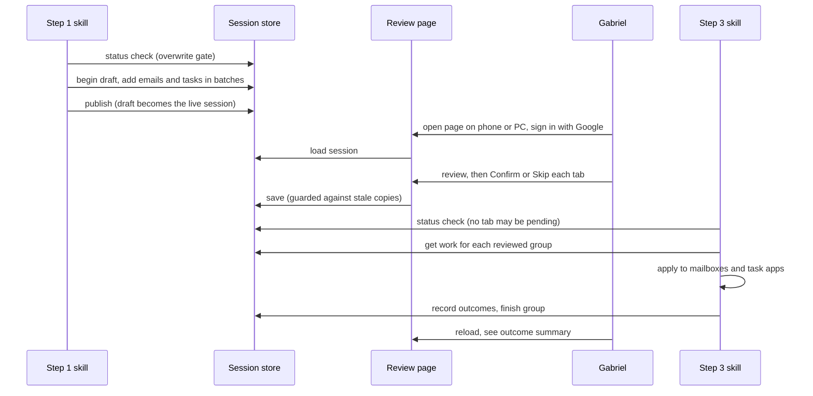
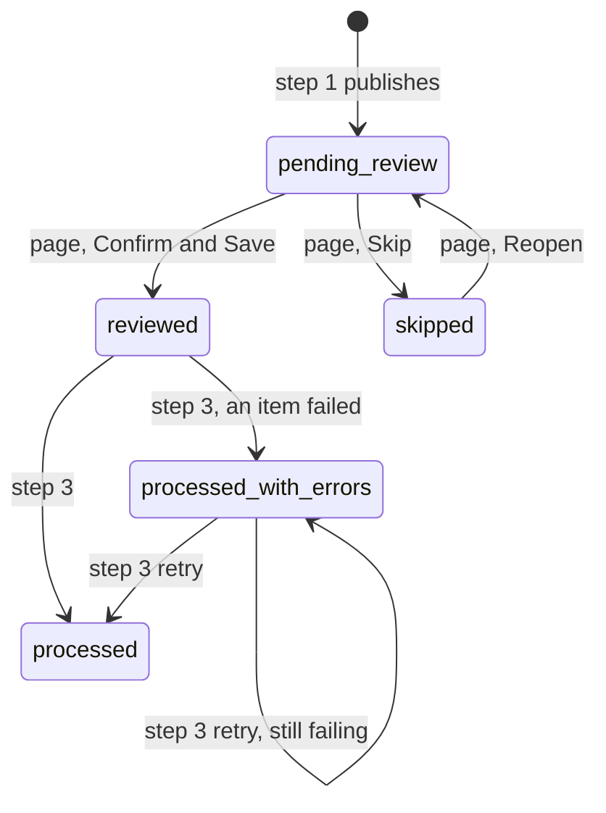

# Functional spec — triage loop on Netlify

What the system does after the change. No implementation detail — that is in [technical-spec.md](technical-spec.md). Build order and prompts are in [instructions.md](instructions.md).

## 1. Purpose

Today the review page only runs in desktop Edge/Chrome (File System Access API) and all three steps share a local file, `triage-session.json`. After this change:

- The review page works on **any browser, including iPhone/iPad**, with no file picker.
- The session lives in **one cloud store**; the page and both skills reach it over HTTPS.
- Only **one Google account** (the Gabriel & Arina Gmail, configured in `ALLOWED_EMAILS`) can open the page.

## 2. What does not change

Everything Gabriel decides and how he decides it. The decision model, the two tabs, per-tab Confirm / Skip / Reopen, thread rows, labels, task editing, the action vocabulary and the session JSON shape stay exactly as described in [CLAUDE.md](../CLAUDE.md) and [triage-session.schema.jsonc](../triage-session.schema.jsonc). Only **where the session is stored and how each step reaches it** changes.

Still local to the PC, untouched: `task-context.md`, `triage-summary.md`, and the mailbox / task MCP servers (`outlook-mcp`, `gabrielandarina-google-tasks`).

## 3. Actors

| Actor | Reaches the session through | Can do |
| --- | --- | --- |
| **pa-email-triage** (step 1 skill) | "triage-session" connector (MCP tools) | Create a new session |
| **Gabriel** (step 2, the page) | Browser, signed in with Google | Edit decisions; Confirm / Skip / Reopen a tab |
| **pa-email-triage-save** (step 3 skill) | "triage-session" connector (MCP tools) | Read decided work, stamp outcomes, mark a group processed |

## 4. The loop

## 5. Group status lifecycle

Unchanged from today; now enforced by the server, not just by convention.

| Transition | Only allowed for |
| --- | --- |
| → `pending-review` (new session) | step 1 |
| `pending-review` → `reviewed` / `skipped`, `skipped` → `pending-review` | the page |
| `reviewed` / `processed-with-errors` → `processed` / `processed-with-errors` | step 3 |

Anything else is refused by the server.

## 6. Sign-in

- Opening the page without a valid sign-in shows the landing card with **Sign in with Google**.
- Google sign-in runs as a full-page redirect (works on iOS). Only an address listed in `ALLOWED_EMAILS` with a verified email gets in; any other account lands back on the landing card with "This Google account is not allowed."
- The sign-in lasts **30 days per browser**. Each device signs in once, then the page opens straight into the session.
- `?type=gabriel` / `?type=gna` survive the sign-in round trip.
- **Sign out** (header) ends the sign-in on that browser only.
- There is no device allowlist: any device where that Google account can sign in works.

## 7. Page behaviour

| Situation | What Gabriel sees | What to do |
| --- | --- | --- |
| Signed in, session exists | The review screen, same as today | — |
| Signed in, no session yet | Landing note: "No session yet — run pa-email-triage." | Run step 1 |
| Not signed in / sign-in expired on load | Landing card with **Sign in with Google** | Sign in |
| Sign-in expired while reviewing, then Confirm / Skip | Toast "Signed out — sign in and press again". Edits stay in memory while the tab stays open | Sign in from the header in a **new tab**, return, press again |
| Confirm / Skip / Reopen, but this tab's group changed elsewhere | Toast `Not saved — <tab> is already "<status>". Reload to see it.` (today's stale-tab guard) | Reload |
| Confirm / Skip / Reopen, but the session changed in any other way since load | Toast "Not saved — session changed. Reload." | Reload, redo edits on that tab |
| Network / server error on save | Toast "Save failed — <reason>"; tab stays editable | Retry |

- **Reload** (header, replaces "Open file…") re-fetches the session. In-memory edits on pending tabs are lost — same as reopening the file today.
- As today, **nothing is saved until Confirm & Save or Skip** is pressed, and each press saves the whole session and locks only that tab.
- When the other tab has moved on since load (reviewed / skipped / processed elsewhere), a save adopts that tab's stored state instead of overwriting it — unchanged behaviour.
- "Browser not supported" no longer exists.

## 8. Skill-facing behaviour (connector tools)

The session is ~210 KB — too large to pass whole through one tool call — so the tools are granular. The skills never read or write the full JSON.

### Step 1 — create a session

| Tool | Behaviour |
| --- | --- |
| `session_status` | Says whether a live session exists, its `generatedAt`, both group statuses, and item counts per group. Step 1 uses it for the **overwrite gate**. |
| `session_begin` | Starts a **draft** from `generatedAt`, `mailboxes`, `gmailLabels`. Refused if the live session has a group that is `pending-review` or `reviewed`, unless called with `discard: true` — which the skill only passes after Gabriel explicitly says to discard. Any earlier draft is replaced. |
| `session_add_emails` | Appends a batch (max 25) of emails to the draft. Refused if an email is malformed, carries `decision` or `outcome`, or repeats an `id`. The error names the email and the field. |
| `session_add_tasks` | Same for `existingTasks` (max 25 per call; repeats of `key` refused). |
| `session_publish` | Checks the whole draft (exactly one head per thread; head-only fields only on heads; every `existingTaskKey` matches a task `key`), then makes it the live session with both groups `pending-review` and `newTasks: []`, and deletes the draft. Refused with a list of problems otherwise. |

The page only ever sees a **published** session — never a half-built one.

### Step 3 — apply a session

| Tool | Behaviour |
| --- | --- |
| `session_status` | Step 3's gate: if either group is `pending-review`, the skill stops and changes nothing. |
| `session_get_work` | For one group and one kind (`emails`, `tasks`, `newTasks`), returns pages of only what the save needs — see the technical spec for fields. Works for a `reviewed` group (everything) and a `processed-with-errors` group (only items whose `outcome` starts with `failed`, any case). Refused for any other status. |
| `session_record_outcomes` | Stamps `outcome` strings on emails (by `id`), existing tasks (by `key`) and new tasks (by index). Can be called as often as the skill likes, so progress survives an interrupted run. Refused unless the group is `reviewed` or `processed-with-errors`. |
| `session_finish_group` | Sets the group to `processed` or `processed-with-errors` and stamps `processedAt` with the server time. Refused unless the group is `reviewed` or `processed-with-errors`. |

### Ownership, enforced by the server

| Keys | Writable by |
| --- | --- |
| Everything step 1 writes today (emails, existingTasks, labels, group skeleton) | step 1 tools only, and only into a draft |
| `decision` blocks, `newTasks`, `groups.<g>.status` = reviewed / skipped / pending-review, `reviewedAt` | the page only |
| `outcome`, `groups.<g>.status` = processed / processed-with-errors, `processedAt` | step 3 tools only |

A `skipped` group is never returned as work and never changes status through the tools — same rule as today.

## 9. Non-goals

- Running the skills fully off the PC. The mailbox and task MCP servers are still local processes; this change only removes the **file** as the thing tying the loop to the PC.
- More than one user, roles, or sharing.
- Offline use.
- History: one live session at a time, overwritten by the next run (as today).
- Backwards compatibility with local `triage-session.json` files. The local-file mode is removed from the page, not kept as a fallback.
