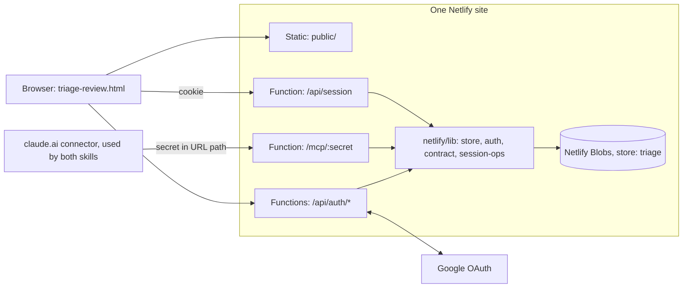
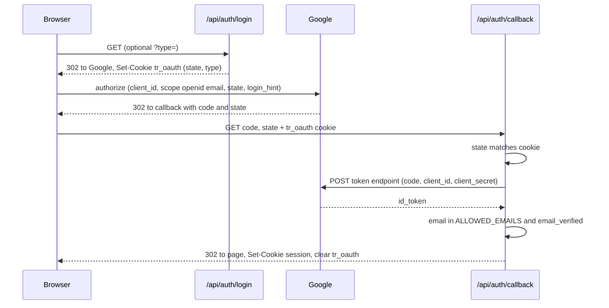
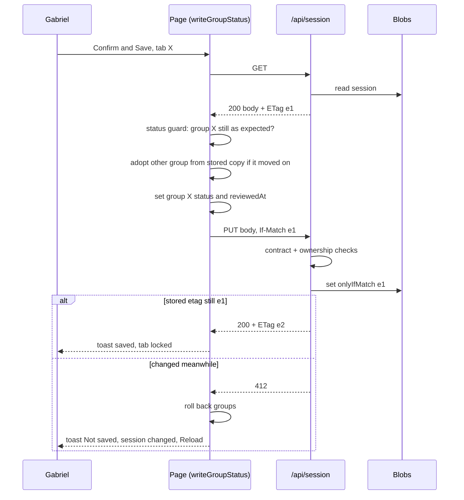

# Technical spec — triage loop on Netlify

How to build what [functional-spec.md](functional-spec.md) describes. Read [CLAUDE.md](../CLAUDE.md) and [triage-session.schema.jsonc](../triage-session.schema.jsonc) first: the session JSON shape and the page's decision logic are **unchanged** and are not restated here.

## 1. Architecture



- One site, one `git push` deploys everything. No always-on process: each function runs per request.
- Only functions touch Blobs. The page and the skills never do.
- The repo is **public**: no secret, site secret path, mailbox address or real session data is ever committed.

## 2. Repo layout

```
netlify.toml
package.json            "type": "module", npm
tsconfig.json           strict, noEmit, ES2022, moduleResolution "bundler"
.gitignore              node_modules, .netlify
public/
  triage-review.html    git mv from repo root
netlify/
  lib/
    store.ts            Blobs access
    auth.ts             cookie sign / verify, requireUser
    contract.ts         zod schemas + invariants
    session-ops.ts      pure session logic (unit-tested)
  functions/
    auth-login.ts       /api/auth/login
    auth-callback.ts    /api/auth/callback
    auth-logout.ts      /api/auth/logout
    session.ts          /api/session
    mcp.ts              /mcp/:secret
test/
  session-ops.test.ts
  contract.test.ts
  fixtures/session.json   SYNTHETIC — built from the schema example, never real mail
```

`netlify.toml`:

```toml
[build]
  publish = "public"
  functions = "netlify/functions"

[[redirects]]
  from = "/"
  to = "/triage-review.html"
  status = 302
```

Functions use the current Netlify Functions API: `export default async (req: Request, context: Context) => Response` plus `export const config = { path: "..." }`. TypeScript strict, no `any`, ESM.

### Dependencies (approved by Gabriel)

| Package | Kind | Why |
| --- | --- | --- |
| `@netlify/blobs` | runtime | the store |
| `@modelcontextprotocol/sdk` | runtime | MCP server |
| `zod` | runtime | MCP tool input schemas (SDK peer) and the session contract |
| `@netlify/functions` | dev | `Context` / `Config` types |
| `typescript` | dev | typecheck |
| `netlify-cli` | dev | `netlify dev`, `netlify link` |

Nothing else. OAuth, cookie signing and HTTP handling are hand-written on `fetch` and `node:crypto`. Anything beyond this list needs Gabriel's OK.

## 3. Environment variables

Set in the Netlify UI (or `npx netlify env:set`). `netlify dev` pulls them after `netlify link`.

| Name | Used by | Secret | Value |
| --- | --- | --- | --- |
| `GOOGLE_CLIENT_ID` | auth-login, auth-callback | no | Google OAuth web client ID |
| `GOOGLE_CLIENT_SECRET` | auth-callback | **yes** | from the same client |
| `ALLOWED_EMAILS` | auth-callback, auth.ts | no, but keep out of the repo | comma-separated; currently one address |
| `SESSION_SECRET` | auth.ts | **yes** | 32 random bytes, hex |
| `MCP_SECRET` | mcp.ts | **yes** | 32 random bytes, hex |

A missing variable must throw at first use with its name — no defaults, no silent fallback.

## 4. Store (`netlify/lib/store.ts`)

- `getStore({ name: "triage", consistency: "strong" })`.
- Keys: `session` (live, what the page sees) and `draft` (step 1 work in progress).
- `readDoc(key)` → `{ doc, etag } | null` via `getWithMetadata(key, { type: "json" })`.
- `writeDoc(key, doc, cond)` with `cond = { onlyIfMatch: etag } | { onlyIfNew: true } | {}` → `set(key, JSON.stringify(doc, null, 2), cond)`; returns `{ etag, modified }`. `modified === false` means the condition failed → callers turn that into HTTP 412 / MCP `CONFLICT`.
- `deleteDoc(key)`.

`onlyIfMatch` / `onlyIfNew` map to `If-Match` / `If-None-Match: *` in `@netlify/blobs` (verified in its source). This replaces the File System Access re-read as the real lost-update guard.

## 5. HTTP API

All responses `Cache-Control: no-store`. Never log request or response bodies.

| Method + path | Auth | Request | Responses |
| --- | --- | --- | --- |
| `GET /api/auth/login?type=<gabriel\|gna>` | none | optional `type` | `302` to Google; sets `tr_oauth` cookie |
| `GET /api/auth/callback?code&state` | `tr_oauth` cookie | — | `302` to `/triage-review.html[?type=…]` with session cookie; `302` to `/triage-review.html?auth=denied` when the account is not allowed; `400` on bad state |
| `POST /api/auth/logout` | cookie | — | `204`, clears the cookie |
| `GET /api/session` | cookie | — | `200` JSON text + `ETag`; `401`; `404` when no live session |
| `PUT /api/session` | cookie + `Origin` must equal the site origin | full session JSON, header `If-Match: <etag>` | `200` + new `ETag`; `401`; `403` bad Origin; `412` etag mismatch; `422` contract or ownership violation (body: `{ error, details[] }`); `428` missing `If-Match` |

`PUT` never creates a session — only `session_publish` does.

### `PUT /api/session` server-side checks, in order

1. Cookie valid, `Origin` matches.
2. `If-Match` present → read stored doc; etag differs → `412`.
3. Body passes the full-session zod schema (decisions included).
4. **Ownership** against the stored doc: `groups.<g>.processedAt` unchanged; every `outcome` (emails, existingTasks, newTasks) unchanged; each group's status change is one of `pending-review → reviewed | skipped`, `skipped → pending-review`, or none.
5. `writeDoc("session", body, { onlyIfMatch })`; `modified === false` → `412`.

## 6. Auth



- Authorize URL: `https://accounts.google.com/o/oauth2/v2/auth`, `response_type=code`, `scope=openid email`, `redirect_uri=<origin>/api/auth/callback`, `state` = 32 random bytes hex, `login_hint` = first entry of `ALLOWED_EMAILS`, `prompt=select_account`.
- Token URL: `https://oauth2.googleapis.com/token`. The `id_token` arrives **directly from Google over TLS in a server-to-server call**, so its payload is decoded and trusted without JWKS signature verification (Google's documented allowance for this case). Still check `aud === GOOGLE_CLIENT_ID`, `email_verified === true`, `email` ∈ `ALLOWED_EMAILS` (case-insensitive).
- `redirect_uri` origin comes from the request URL, so the same code serves `https://<site>.netlify.app` and `http://localhost:8888`.
- `type` is accepted only if it is `gabriel` or `gna`; anything else is dropped (no open redirect — the return target is always `/triage-review.html`).

**Cookies**

| Cookie | Content | Flags |
| --- | --- | --- |
| `tr_oauth` | `state` + `type` | `HttpOnly; Secure; SameSite=Lax; Path=/api/auth; Max-Age=600` |
| `__Host-tr_session` | `base64url(JSON {email, exp})` + `.` + `base64url(HMAC-SHA256(payload, SESSION_SECRET))` | `HttpOnly; Secure; SameSite=Lax; Path=/; Max-Age=2592000` (30 d) |

`requireUser(req)` verifies the HMAC with `timingSafeEqual`, checks `exp`, and re-checks the email against `ALLOWED_EMAILS` (so removing an address revokes it). No token is ever readable by page JS.

CSRF: `SameSite=Lax` + the `Origin` check on `PUT` and `POST`; the API sends no CORS headers.

## 7. MCP endpoint (`netlify/functions/mcp.ts`)

- Path `/mcp/:secret`. Compare `:secret` to `MCP_SECRET` with `timingSafeEqual` (length-check first); mismatch → `404`, empty body.
- Stateless Streamable HTTP: a new server + transport per request, no session IDs, JSON responses (no SSE needed). `GET` / `DELETE` → `405`.
- Server name `triage-session`. Tools registered with zod input schemas.
- **Known weakness, accepted for v1:** claude.ai custom connectors support OAuth or nothing — no custom headers. The secret therefore sits in the connector URL (claude.ai settings) and in Netlify request logs. It is bearer-token strength, not more. Follow-up: real OAuth on this endpoint.

### Tool errors

Return `{ isError: true, content: [{ type: "text", text: "<CODE>: <message>" }] }`.

| Code | Meaning |
| --- | --- |
| `NO_SESSION` | no live session |
| `NO_DRAFT` | `session_add_*` / `session_publish` without `session_begin` |
| `VALIDATION` | input or draft breaks the contract; message lists `path: problem` lines |
| `WRONG_STATUS` | the group or session is not in a status that allows this tool |
| `CONFLICT` | etag retries exhausted (3 attempts) |

### Tools

`group` is always `"gabriel" | "gabriel-arina"`. Group membership is the schema's: emails by `source` (`gmail` → `gabriel-arina`, else `gabriel`); tasks and newTasks by `provider` (`gtasks` → `gabriel-arina`, `todo` → `gabriel`).

| Tool | Input | Output | Rules |
| --- | --- | --- | --- |
| `session_status` | — | `{ exists, generatedAt, groups, counts: { <group>: { heads, emails, existingTasks, newTasks } }, draft: { exists, emails, existingTasks } }` | never errors on a missing session: `exists: false` |
| `session_begin` | `{ generatedAt, mailboxes: string[], gmailLabels: string[], discard?: boolean }` | `{ ok: true }` | `WRONG_STATUS` if the live session has a group `pending-review` or `reviewed` and `discard !== true`. Writes `draft` = `{ generatedAt, mailboxes, gmailLabels, groups (both pending-review, null dates), emails: [], existingTasks: [], newTasks: [] }`, replacing any draft |
| `session_add_emails` | `{ emails: Email[] }` (1–25) | `{ added, totalEmails }` | zod per email; reject `decision` / `outcome` keys; reject duplicate `id` (within the batch or the draft) |
| `session_add_tasks` | `{ existingTasks: Task[] }` (1–25) | `{ added, totalTasks }` | zod per task; reject `decision` / `outcome`; reject duplicate `key` |
| `session_publish` | — | `{ ok: true, counts }` | runs draft invariants (below); re-checks the overwrite gate unless the draft was begun with `discard`; `writeDoc("session", draft)`; `deleteDoc("draft")` |
| `session_get_work` | `{ group, kind: "emails" \| "tasks" \| "newTasks", cursor?: string, limit?: number }` (limit default 25, max 50) | `{ group, status, kind, total, items, nextCursor }` | `WRONG_STATUS` unless the group is `reviewed` or `processed-with-errors`. In `processed-with-errors`, only items whose `outcome` matches `/^failed/i`. `cursor` is an opaque offset string |
| `session_record_outcomes` | `{ group, emails?: {id, outcome}[], tasks?: {key, outcome}[], newTasks?: {index, outcome}[] }` | `{ updated, unknown: string[] }` | `WRONG_STATUS` unless `reviewed` / `processed-with-errors`. Items outside `group` or not found go in `unknown`, nothing else fails. Read–patch–`onlyIfMatch` loop, 3 attempts |
| `session_finish_group` | `{ group, status: "processed" \| "processed-with-errors" }` | `{ group, status, processedAt }` | `WRONG_STATUS` unless `reviewed` / `processed-with-errors`. `processedAt = new Date().toISOString()`. Same retry loop |

`session_get_work` item shapes (only what step 3 needs — never the whole email):

- `emails` → **every** email of the group, heads and children: `{ id, source, threadId, threadRole, inInbox, subject, isFlagged, labels?, existingTaskKey?, action: decision.emailAction, flagged: decision.flagged, wantedLabels?: decision.labels, task?: decision.task ?? suggestedTask, outcome? }`. `task` is present only when `action === "create-task"`.
- `tasks` → existing tasks of the group with `decision.complete || decision.cancel || decision.edits !== null`: `{ key, provider, listId, title, status, notes, dueDate, link, threadId, complete, cancel, edits, outcome? }`.
- `newTasks` → `{ index, title, notes, provider, dueDate, outcome? }`, `index` = position in the full `newTasks[]` array.

### Contract (`netlify/lib/contract.ts`)

zod schemas derived field-for-field from `triage-session.schema.jsonc` — that file stays the authority; if they disagree, the schema file wins and the zod gets fixed. Objects are `.passthrough()` so unknown keys survive (the "never drop a key you don't understand" rule).

Draft invariants checked by `session_publish`:

1. `groups` has exactly `gabriel` and `gabriel-arina`.
2. Every `threadId` has exactly one `threadRole: "head"`.
3. `category`, `suggestedTask`, `existingTaskKey`, `newInThread` appear only on heads.
4. Every non-null `existingTaskKey` equals the `key` of one `existingTasks[]` entry.
5. Vocabularies: `source`, `provider`, `category`, task `status`.
6. `sourceId === source + ":" + id`.

### `netlify/lib/session-ops.ts`

Pure functions, no I/O — everything in the tool table's "Rules" column plus the `PUT` ownership check: `canOverwrite(live)`, `appendEmails(draft, batch)`, `appendTasks(draft, batch)`, `checkDraft(draft)`, `groupOf(item)`, `extractWork(session, group, kind, cursor, limit)`, `applyOutcomes(session, group, patch)`, `finishGroup(session, group, status, now)`, `checkPageWrite(stored, incoming)`. Functions and the MCP handler stay thin wrappers around these + `store.ts`.

## 8. Save path (page)



## 9. Page changes (`public/triage-review.html`)

Line numbers are as of commit `5364851`; find by name if they have moved. The storage seam is narrow: two reads (1157, 2006), one write (2024–2026), connect logic in `openViaPicker` / `reopenStored` / `boot`.

**Delete**
- IndexedDB block: `idbOpen`, `storeHandle`, `loadStoredHandle` (1096–1125).
- `openViaPicker` (1128–1138), `reopenStored` (1140–1151), the `fileHandle` global (997).
- `#screen-unsupported` markup (721–728) and its branch in `render()` (1417–1421); remove it from the `screens` array.
- `#btn-reopen` and the `loadStoredHandle().then(...)` in `render()` (1426–1431); the `showOpenFilePicker` bail and handle logic in `boot()` (2271–2280).

**Add**
- `let sessionETag = null;`
- `async function readSession()` → `fetch("/api/session", { cache: "no-store" })`; `401` → throw `AuthRequired`; `404` → throw `NoSession`; else `{ text, etag }`.
- `async function writeSession(text, etag)` → `PUT` with `If-Match`, `Content-Type: application/json`; `401` → `AuthRequired`; `412` → `Conflict`; other non-2xx → `Error` carrying the server's `error` text; returns the new etag.
- `<meta http-equiv="Content-Security-Policy" content="default-src 'none'; script-src 'unsafe-inline'; style-src 'unsafe-inline'; connect-src 'self'; img-src data:; base-uri 'none'; form-action 'self'">` — with no token in JS and `connect-src 'self'`, a missed escape cannot exfiltrate mail. Still audit that every email-derived string reaches `innerHTML` through the page's escape helper.

**Change**
- `loadFromHandle(handle)` → `loadSession()`: same body; source is `readSession()`; keep `sessionETag`; drop `storeHandle`. `AuthRequired` → landing; `NoSession` → landing with `#landing-note` = "No session yet — run pa-email-triage." (`#landing-note` exists and is unused today).
- `writeGroupStatus()` (1999–2034): line 2006 → `const { text, etag } = await readSession(); const onDisk = JSON.parse(text);`. Lines 2024–2026 → `sessionETag = await writeSession(JSON.stringify(session, null, 2), etag);`. **Status guard, `adoptGroupFromDisk` and the `session.groups` rollback stay exactly as they are.** Catch: `Conflict` → "Not saved — session changed. Reload."; `AuthRequired` → "Signed out — sign in and press again" and reveal a header `Sign in` link with `target="_blank"` so in-memory edits survive.
- Landing card: `#btn-open` becomes `<a class="btn btn-primary" href="/api/auth/login">Sign in with Google</a>`, forwarding `?type=` when present; copy rewritten; `?auth=denied` → `#landing-note` = "This Google account is not allowed." then strip the param with `history.replaceState`.
- Header: `#btn-open-other` "Open file…" → **Reload** (`loadSession`); add **Sign out** (`POST /api/auth/logout`, then landing). Header meta (1436–1438) drops `fileHandle.name`.
- `boot()`: `initTheme(); render(); await loadSession();`.
- Version stamp: set once, in the commit that is pushed (rule in CLAUDE.md).

## 10. Testing and verification

**Static**
- `npx tsc --noEmit` clean.
- `node --test` on `test/*.test.ts` (Node's built-in TypeScript stripping; confirm `node --version` ≥ 22.18, otherwise ask before adding anything). Cover: overwrite gate, duplicate ids/keys, each publish invariant, `extractWork` for `reviewed` vs `processed-with-errors`, pagination, `applyOutcomes` unknown ids, `finishGroup` refusals, every `checkPageWrite` refusal.
- Fixture is **synthetic**. Never copy the real session into the repo.
- Page: extract the `<script>` body → `node --check`.

**Local, `npx netlify dev` on `http://localhost:8888`, Playwright attached to Gabriel's signed-in tab (`--extension`)**

1. Wrong Google account → back on landing with "not allowed". Allowed account → review screen or "No session yet"; `?type=gna` preserved. Reload → no prompt.
2. Seed via MCP against `http://localhost:8888/mcp/<MCP_SECRET>`: read the real session from `D:\Gabriel\OneDrive\Claude\Workspace\PA\Email Triage\triage-session.json` **in place** (script in the scratchpad, not the repo), strip `decision` / `outcome`, then `session_begin` → `session_add_emails` ×N → `session_add_tasks` ×N → `session_publish`. Page head counts per tab match the same file opened in the current GitHub Pages version.
3. Skip → Reopen on one tab; `GET /api/session` before and after differs only in that group.
4. Two browser tabs, A and B, both loaded on the same session:
   - Confirm the Gabriel tab in A, then Confirm the Gabriel tab in B → B shows the status-guard toast, nothing written.
   - Skip the *other* tab in A, then Confirm the remaining tab in B → B saves, and adopts A's skipped tab instead of overwriting it.
   - 412 path: the window is between B's re-read and its PUT, so force it — in B's console, wrap `readSession` to pause after the GET, change the stored doc from A meanwhile, release → B shows "Not saved — session changed. Reload." and its groups are rolled back.
5. Negative: `GET /api/session` no cookie → 401; `PUT` no `If-Match` → 428; `PUT` with an edited `outcome` → 422; `/mcp/wrong` → 404; `session_finish_group` on a pending group → `WRONG_STATUS`; `session_begin` over a pending session → `WRONG_STATUS`, with `discard: true` → ok.
6. Step-3 shape: Confirm a tab, `session_get_work` for all three kinds, `session_record_outcomes`, `session_finish_group` → page shows the outcome summary for that tab.

Report what was **seen**, not what was expected. The claude.ai connector handshake and real iOS Safari cannot be tested from the dev machine — say so; they are Gabriel's checks (instructions.md steps 5 and 7).

## 11. Deploy, cut-over, rollback

- Work on branch `netlify`. `master` keeps serving the current local-file page on GitHub Pages until cut-over, so the existing loop keeps working.
- Netlify production branch = `netlify` until cut-over (a branch-deploy URL has a different origin and would break the Google redirect URI).
- Cut-over: fast-forward `master` to `netlify`, Netlify production branch → `master`, GitHub Pages off.
- Rollback before cut-over: nothing to do. After: re-enable GitHub Pages on the last pre-merge commit and restore the previous skill versions on claude.ai.

## 12. Open items — confirm while building, do not guess

1. **MCP transport class.** Which `@modelcontextprotocol/sdk` server transport accepts a fetch-style `Request` and returns a `Response` in the installed version. Look it up with context7. If none fits, a hand-written stateless JSON-RPC handler (`initialize`, `notifications/initialized` → 202, `tools/list`, `tools/call`) is acceptable — ask first.
2. **`__Host-` cookie on `http://localhost:8888`.** If the browser rejects it under `netlify dev`, report it and propose the smallest fix; do not weaken the production cookie.
3. **`consistency: "strong"` under `netlify dev`.** If the local emulator throws `BlobsConsistencyError`, report it.
4. **Tasks with no changes.** The save skill's outcome list includes `untouched`-style strings; `session_get_work` does not return unchanged tasks. Check how the page's processed summary renders a task with no `outcome`; if it needs one, have `session_finish_group` stamp `"untouched"` on the group's tasks that have none — and add that to the functional spec.
5. Docs to update in the same branch: `CLAUDE.md` (no longer "no build, no server, no deps"; storage / auth / MCP sections; stale guard = status + etag), `triage-session.schema.jsonc` header (location; "write the whole JSON back" → tools + endpoint per step), `README.md`, `improvements.md` change log.

## 13. Follow-ups (out of scope)

- OAuth on `/mcp` instead of the secret path.
- Host `outlook-mcp` and `gabrielandarina-google-tasks` remotely — the real "skills off the PC" step.
- Noticed, untouched: the dead `outlook` server in the repo's `.mcp.json` (points at a directory that does not exist); `.claude/settings.json` `additionalDirectories` still names the old `Personal Assistance` path.
